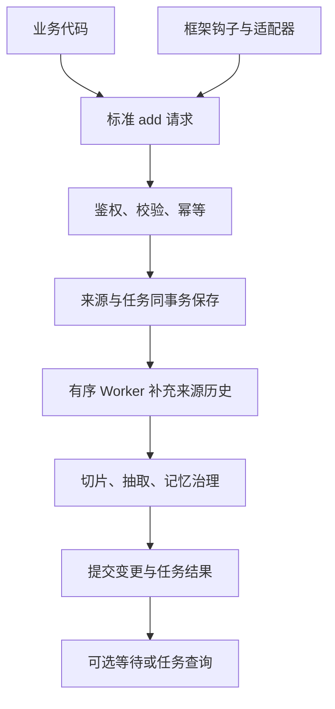

# MemoryCMIC 对话接入与抽取触发方案

> 版本：V1.2（本轮讨论最终版）｜日期：2026-09-24  
> 性质：待实现的开发契约，不表示现有代码已经具备全部能力。  
> 本版替换 V1.1 的接入、触发和响应设计。接口长度、批次及超时数值是首期默认配置，需部署验证。

## 1. 最终决策与范围

**调用方提交新增消息，服务端补充已有历史；每次提交触发处理，普通场景异步执行，需要确认时等待结果。**

1. 公共接口只保留 `add` 和任务查询；API、SDK、框架钩子共用同一契约。
2. 对话消息按不可变来源接入，不对外提供 `revision`。用户纠正此前说法是一条新消息，由记忆治理更新旧记忆。
3. 服务保存来源并建立任务后立即安排抽取，不等待消息数量或会话空闲，不提供 `final`、`flush`。
4. 已有历史从 `source_record` 读取，不另建对话正文库；调用方可选补充尚未接入的历史。
5. 普通公共响应只有 `task_id`、`status`、`results`、`error` 四项。来源映射、诊断、执行次数、切片及派生任务状态只在内部记录。
6. 服务内部负责重试、诊断恢复和最终失败告警。普通钩子只需确保可靠接收，不必逐任务轮询。
7. 首期不提供 webhook、公开重试、补上下文重处理接口，不要求业务实现诊断决策器。
8. 消息标准化和触发属于本模块；事实抽取、范围判定、重复/替代/争议处理属于下游模块，但本文明确其结果提交和返回约束。

参考边界：借鉴 Mem0 的统一 add 入口、调用触发和简洁结果表达。MemoryCMIC 的来源证据、替代关系、任务持久化、状态与 HTTP 约定是本系统设计，不能声称逐项来自 Mem0。本文件不承诺与 Mem0 API 兼容。

## 2. 功能清单

| 编号 | 功能 | 责任方 | 完成要求 |
| --- | --- | --- | --- |
| F01 | 接入身份与用户授权 | API 层 | 从凭证解析租户、来源权限及调用 Agent，检查目标用户权限 |
| F02 | 框架事件采集与增量识别 | 适配器 | 获取新增消息，稳定消息 ID，过滤非原始对话内容 |
| F03 | 框架格式转换 | 适配器/业务 API 集成代码 | 原生消息转换为本文 Message |
| F04 | 统一校验与规范化 | 接入服务 | 字段、角色、工具关系、大小、时间及消息内容校验 |
| F05 | 来源保存与幂等 | 接入服务 | 重试不重复保存，不允许同 ID 更换正文 |
| F06 | 持久化任务 | 接入服务 | 来源、请求回执、任务、审计在同一事务提交 |
| F07 | 历史读取与组装 | 上下文模块 | 来源隔离、边界固定、优先关联消息、预算裁剪 |
| F08 | 抽取输入切片 | 上下文模块 | 目标不静默截断，保留证据定位，切片可恢复 |
| F09 | 抽取及记忆治理调用 | Worker | 抽取、范围校验、证据、重复及替代处理 |
| F10 | 调度、重试与恢复 | Worker | 会话内有序、进程故障可恢复、失败有明确终态 |
| F11 | 结果提交与查询 | 任务/API 层 | 返回已提交变更；支持部分结果及等待超时 |
| F12 | 诊断、审计、告警 | 服务内部 | 按诊断执行动作，不要求普通业务理解内部流程 |



## 3. 接入模式及职责

### 3.1 API 模式

业务代码从自身消息存储中获取新增消息，按标准契约调用 add。调用时点可以是回合结束、任务完成、历史批量导入，或用户要求记住/更正时。一次请求可包含多个连续回合，不限定每次只能一轮。

SDK 封装鉴权、序列化、稳定请求重试及任务查询；业务自定义字段的含义仍需业务映射，SDK 不自动猜测角色和作者。

### 3.2 钩子模式

平台按框架提供适配器，部署在业务 Agent 环境中；服务端不直接解析任意框架的原生对象。适配器执行：

1. 监听完整回合结束，收集本回合新增用户消息、最终回复及必要工具记录。
2. 排除模型内部思考、框架控制提示词、注入的旧记忆及未完成流式片段。
3. 映射角色、作者、时间、正文、工具调用及结果；有原生消息 ID 则复用，没有则首次采集时生成并持久化。
4. 保存待提交批次及稳定幂等键，通过 add 异步提交。
5. 收到合法 200/202 任务响应即表示来源已可靠接收，推进送达位置；后续抽取失败由服务处理。
6. 网络中断、请求超时、429、可重试 5xx 使用同一幂等键重试。字段或 ID 冲突进入接入告警，不无限重投。

可靠投递可复用业务消息库和消费位点；没有时提供可恢复的本地待发送记录。不能仅依赖进程内存。进程重启后继续使用原 message_id 和幂等键。

框架无 turn_id 时允许省略；无原始时间时由适配器记录首次观测时间，重试复用。AgentScope/OpenClaw 的实际事件及字段须针对接入版本验证，不假定所有框架一致。

### 3.3 结果处理边界

| 场景 | 行为 |
| --- | --- |
| 普通回合结束钩子 | 确认消息接收即可，默认不轮询每个抽取任务，不打断用户对话 |
| 业务要检查批量结果 | 调用任务查询，SDK 可封装轮询 |
| 用户要求记住/更正并需要确认 | 最终回复前调用 add 并等待，超时可继续查询；未确认不能说已保存/已更正 |
| 抽取内部失败 | 服务自动恢复并在终结后告警；不要求业务模型决策是否重试 |
| 未来有主动通知需求 | 单独增加应用级 webhook，首期不实现 |

channel 是交互渠道元数据，不是框架适配机制，也不直接决定记忆的业务适用范围。

## 4. 公共接口与通用规范

| 方法 | 路径 | 作用 |
| --- | --- | --- |
| POST | `/api/v1/memories:add` | 接收新增消息并触发抽取，可限定时间等待 |
| GET | `/api/v1/tasks/{task_id}` | 查询当前状态及已结束结果 |

- JSON/UTF-8；字段区分大小写；未列出的字段拒绝，扩展数据放 metadata.extensions。
- 可选字段省略使用默认值；除明确允许 null 外，不接收 null。
- 每次 add 只允许一个来源、用户和会话。ID 是不透明字符串，不从名称推断权限。
- 时间使用带时区 RFC3339，内部转换 UTC。保留原始正文，不用模型摘要替换。
- 服务端从凭证得到 tenant_id、client_id、caller_agent_id；正文不能覆盖授权。
- `user_id` 必须是已映射的统一用户 ID。首期 user 消息均属于该用户，不做群聊多主体抽取。
- `business_domain`、`project_id` 不要求业务上传；来源业务来自配置，记忆适用范围由抽取模块识别并校验。项目不能解析成可靠 ID 时跳过项目限定候选，不把未知范围当公共范围。

### 4.1 请求与响应头

| 名称 | 方向 | 必填 | 定义 |
| --- | --- | --- | --- |
| Authorization | 请求 | 是 | `Bearer <credential>`，两个接口均需验证 |
| Content-Type | add 请求 | 是 | application/json |
| Idempotency-Key | add 请求 | 是 | 1–128 ASCII 字符，同一提交重试复用，不等同 message_id |
| X-Request-ID | 请求 | 否 | 1–128 字符，追踪当前 HTTP 请求；缺省由服务生成 |
| X-Request-ID | 响应 | 是 | 本次请求追踪 ID，供排障，不放正文重复返回 |
| Retry-After | 429 响应 | 是 | 建议等待秒数 |

## 5. add 入参定义

### 5.1 AddRequest

| 字段 | 类型 | 必填 | 默认 | 约束与含义 |
| --- | --- | --- | --- | --- |
| source_system | string | 是 | — | 1–64 字符；已登记且凭证允许的来源系统 |
| user_id | string | 是 | — | 1–128 字符；有写权限的统一用户 |
| session_id | string | 是 | — | 1–128 字符；来源内稳定会话标识，不能跨用户复用 |
| messages | Message[] | 是 | — | 1–100 条；本次新增目标，按实际对话顺序排列 |
| history_messages | Message[] | 否 | [] | 0–100 条；补充前序上下文，按历史顺序排列，不单独抽取 |
| wait_for_result | boolean | 否 | false | 是否在接收后等待任务终结 |
| wait_timeout_ms | integer | 否 | 10000 | 仅 wait_for_result=true 时允许；1–30000 毫秒 |

请求总 JSON UTF-8 大小上限 2 MiB。messages 和 history_messages 之间及各自内部不得重复 message_id。补充历史发生在目标之前；不能把未来消息放入 history_messages。

wait_for_result=false 时不传 wait_timeout_ms；开启等待不新建执行路径。等待从接入事务提交后开始，到期返回 pending，任务继续执行。等待超时不等于模型超时。

### 5.2 Message

| 字段 | 类型 | 必填 | 默认/约束 |
| --- | --- | --- | --- |
| message_id | string | 是 | 1–256 字符；会话内稳定唯一，新消息用新 ID |
| role | enum | 是 | user / assistant / tool / system |
| content | string | 是 | 非空；单条 UTF-8 最多 64 KiB；文本或 JSON 序列化文本 |
| occurred_at | datetime | 是 | 带时区的事件时间；缺少时由适配器填首次观测时间 |
| author_id | string | 否 | 1–128；user 缺省 user_id，assistant 缺省认证 Agent，tool 缺省 tool_name，system 缺省 source_system |
| turn_id | string | 否 | 1–128；可选回合分组，不作为幂等键 |
| reply_to_message_id | string | 否 | 1–256；同会话被回复消息，不存在时记录诊断 |
| metadata | MessageMetadata | 否 | 默认 {} |

user 的显式 author_id 必须等于 user_id；assistant 作者必须属于凭证允许的作者集合。system 只接收显式业务任务背景，不能上传内部控制提示词。assistant/system 内容不单独证明用户事实。

没有 revision。用户说“之前说错了”是一条新来源；已发送消息的重新编辑不在首期接入范围。

### 5.3 MessageMetadata

| 字段 | 类型 | 约束 |
| --- | --- | --- |
| channel | string，可选 | 1–64 字符，配置允许的交互渠道 |
| timestamp_origin | enum，可选 | source / adapter_observed，默认 source |
| tool_name | string | role=tool 必填，1–128；其他角色禁止 |
| tool_call_id | string | role=tool 必填，1–128；其他角色禁止 |
| tool_status | enum | role=tool 必填，succeeded / failed / unknown；unknown 不能证明成功 |
| tool_calls | ToolCall[]，可选 | 默认 []，仅 assistant，最多 20 项 |
| attachments | AttachmentRef[]，可选 | 默认 []，最多 20 项，不嵌入附件正文 |
| extensions | object，可选 | 默认 {}，JSON 最多 8 KiB；不参与授权，不默认进入模型输入 |

整个 metadata 最多 16 KiB。

**ToolCall**：必填 tool_call_id:string(1–128)、tool_name:string(1–128)；可选 arguments:object，单项 JSON 最多 8 KiB。仅记录实际发起的调用；不能当成成功结果。

**AttachmentRef**：必填 file_id:string(1–256)、mime_type:string(1–128)；可选 name:string(1–256)、sha256:string(64 位小写十六进制)。本模块不下载附件，不声称已读取附件正文。

工具实际结果放 content，工具身份与状态放 metadata。凭证和无关大段输出由适配器过滤；长文档走独立来源通道。

### 5.4 请求示例

```json
{
  "source_system": "email_agent",
  "user_id": "user_1001",
  "session_id": "session_101",
  "messages": [
    {
      "message_id": "msg_101",
      "role": "user",
      "content": "以后周报都使用项目符号。",
      "occurred_at": "2026-09-24T09:00:00+08:00"
    },
    {
      "message_id": "msg_102",
      "role": "assistant",
      "content": "好的。",
      "occurred_at": "2026-09-24T09:00:02+08:00"
    }
  ],
  "wait_for_result": false
}
```

工具 Message 示例：

```json
{
  "message_id": "msg_tool_1",
  "role": "tool",
  "content": "{\"event_id\":\"evt_1\",\"created\":true}",
  "occurred_at": "2026-09-24T09:00:01+08:00",
  "metadata": {
    "tool_name": "calendar.create_event",
    "tool_call_id": "call_1",
    "tool_status": "succeeded"
  }
}
```

## 6. 公共出参定义

### 6.1 TaskResponse

add 成功接收后的响应、任务查询的响应使用同一对象。以下四个字段始终返回，不返回内部 IngestItem、Diagnostic、downstream 等对象。

| 字段 | 类型 | 含义 |
| --- | --- | --- |
| task_id | string | 不透明任务 ID，1–128 字符；幂等重放复用原 ID |
| status | enum | pending / succeeded / partial / failed / cancelled |
| results | MemoryResult[] 或 null | pending 固定 null；终态为数组，仅列本请求执行中已提交变更，没有则 [] |
| error | ErrorInfo 或 null | pending/succeeded 为 null；partial/failed/cancelled 返回主要原因 |

**MemoryResult**：

| 字段 | 类型 | 必填 | 含义 |
| --- | --- | --- | --- |
| id | string | 是 | 受影响的记忆 ID |
| memory | string | 是 | 对应操作提交时的记忆正文；是历史操作结果，不保证查询时仍有效 |
| event | enum | 是 | ADD / SUPERSEDE / DISPUTE |
| previous_memory_ids | string[] | SUPERSEDE 时必填 | 被替代的旧记忆，至少一项；其他 event 不返回 |

- ADD：新增有效记忆。
- SUPERSEDE：创建新记忆并使列出的旧记忆不再在线有效；不能仅新增而未停用旧值就返回此事件。
- DISPUTE：该记忆进入争议状态，不应作为有效事实使用；涉及多个记忆时逐项返回。
- 重复事实仅补证据、普通消息无事实、上下文不足跳过：默认不生成 MemoryResult，细节留在内部。
- 多切片可对同一记忆产生多个事件，按提交顺序返回。需要当前事实时使用记忆读取接口，不能将历史任务结果永远视为最新状态。

**ErrorInfo**：仅含必填 `code:string`、`message:string`。业务以 code 判断，message 用于说明，不解析自然语言触发自动动作。

### 6.2 状态含义

| 状态 | 是否终态 | 结果语义 | 业务动作 |
| --- | --- | --- | --- |
| pending | 否 | 正在排队、运行或服务内部重试；不暴露中间已提交切片 | 需要确认时继续查询，普通钩子不用持续查询 |
| succeeded | 是 | 所有目标已评估，允许无事实或部分候选按规则跳过 | 检查 results，不能只凭状态说“已记住” |
| partial | 是 | 技术处理未全部完成，已有至少一个切片提交了记忆/证据变更 | results 返回已提交可见事件；可能因只补证据而为空，不承诺全部完成 |
| failed | 是 | 技术处理失败且未提交任何记忆/证据变更 | 不声明成功；服务告警，必要时运维处理 |
| cancelled | 是 | 执行前取消或因目标来源不可用停止，且没有已提交变更 | 不声明成功 |

存在已提交变更后再取消或失败，一律 partial，不能隐藏部分副作用。候选按语义规则跳过不是技术失败，不使用 partial；成功结果为空也不能证明所有输入都值得或已经被记住。

### 6.3 HTTP 约定

| 操作 | HTTP | 含义 |
| --- | --- | --- |
| add 接收成功、仍 pending | 202 | 来源及任务已可靠保存，不代表形成记忆 |
| add 等待结束或重放时任务已终结 | 200 | 返回终态快照，仍需检查 status/results |
| GET 查询合法且有权访问 | 200 | 查询成功，任务本身可以 pending 或 failed |
| 接入字段/权限冲突 | 4xx | 未接收本批新数据，按统一错误结构返回 |
| 服务异常 | 5xx | 事务是否提交可能不确定，使用同幂等键重试 |

不照搬其他产品 HTTP 语义；上述约定是本服务契约。等待模式任务最终失败可返回 200+failed，因为来源接收已成功，失败发生在后台处理阶段。

### 6.4 响应示例

异步接收（202）：

```json
{"task_id":"task_101","status":"pending","results":null,"error":null}
```

更正成功（200）：

```json
{
  "task_id": "task_102",
  "status": "succeeded",
  "results": [
    {"id":"mem_new","memory":"用户从事开发工作。","event":"SUPERSEDE","previous_memory_ids":["mem_old"]}
  ],
  "error": null
}
```

无记忆变更（200）：

```json
{"task_id":"task_103","status":"succeeded","results":[],"error":null}
```

失败（任务结果）：

```json
{
  "task_id":"task_104",
  "status":"failed",
  "results":[],
  "error":{"code":"EXTRACTION_FAILED","message":"记忆抽取失败，服务已完成自动重试。"}
}
```

## 7. 任务查询入参及结果处理

`GET /api/v1/tasks/{task_id}`

| 参数 | 位置 | 类型 | 必填 | 约束 |
| --- | --- | --- | --- | --- |
| task_id | path | string | 是 | 1–128，add 返回的任务 ID |
| Authorization | header | string | 是 | 有目标任务的用户及来源访问权限 |

不接受查询参数和请求体；返回第 6 节 TaskResponse。无权或不存在均返回 404，避免暴露跨租户任务。

需要轮询的 SDK 建议从 1 秒逐步退避至 5 秒；业务可停止轮询，停止轮询不取消任务。服务不在 add 返回后再次发送同一个 HTTP 响应。首期没有 webhook，结果通过等待或查询获取。

运维重试可作为内部受控操作实现，不是公共契约。终态任务快照不重新改回 pending；运维重新执行建立关联的新任务并记录审计，避免旧任务结果含义变化。普通重复 add 不能被用作强制重处理接口。

## 8. 接入错误与任务错误

### 8.1 接入/查询错误

统一错误正文为 `{"error":{"code":"...","message":"..."}}`，不返回虚假的 task_id。X-Request-ID 用于定位详细日志。单条消息字段错误或冲突导致整个批次回滚，不部分写入。

| HTTP | code | 触发条件 | 调用方动作 |
| --- | --- | --- | --- |
| 400 | INVALID_JSON | 非法 JSON | 修正格式 |
| 401 | UNAUTHENTICATED | 无效凭证 | 修复认证 |
| 403 | FORBIDDEN | 无用户或来源权限 | 修复授权 |
| 404 | TASK_NOT_FOUND | 任务不存在或无权查询 | 检查 ID/权限 |
| 409 | IDEMPOTENCY_CONFLICT | 同请求键不同业务内容 | 修复键使用；不能覆盖原请求 |
| 409 | MESSAGE_ID_CONFLICT | 同消息 ID 不同标准语义内容 | 检查是否误用 ID；新消息应使用新 ID |
| 409 | SESSION_OWNER_CONFLICT | 同来源会话绑定其他用户 | 修正会话映射 |
| 413 | PAYLOAD_TOO_LARGE | 消息/请求超过字节限制 | 减小批次或改用文档来源 |
| 422 | INVALID_MESSAGE | 字段、角色、工具信息、重复消息 ID 不合法 | 修正输入 |
| 429 | RATE_LIMITED | 接入限流 | 按 Retry-After 原键重试 |
| 503 | SERVICE_UNAVAILABLE | 暂时不可用 | 原键重试 |
| 500 | INTERNAL_ERROR | 未预期错误 | 原键有限重试并报告追踪 ID |

示例：

```json
{"error":{"code":"MESSAGE_ID_CONFLICT","message":"同一消息标识已绑定不同内容，请检查 message_id。"}}
```

### 8.2 公共任务错误

| code | 含义 | 服务动作 / 调用方动作 |
| --- | --- | --- |
| EXTRACTION_FAILED | 模型或输出校验在有限重试后仍失败 | 服务告警；业务不再声明保存成功 |
| INPUT_PROCESSING_FAILED | 输入无法安全切分或组装 | 服务记录详情；必要时调整输入方式 |
| MEMORY_WRITE_FAILED | 记忆提交失败且重试耗尽 | 服务告警；结果按是否已有提交区分 partial/failed |
| PRIOR_TASK_FAILED | 会话前序失败阻止处理 | 当前任务终结失败并告警，不无限 pending；由运维修复会话队列 |
| SOURCE_UNAVAILABLE | 目标或必要证据来源失效 | 服务取消或返回 partial，禁止提交过期证据 |
| TASK_CANCELLED | 运维取消 | 返回 cancelled 或 partial，并有内部审计 |

响应中不暴露 retryable、blocked_by_task_id。自动重试尚在进行时为 pending；最终错误表示该轮自动恢复已结束，不要求业务反复提交相同输入。

## 9. 来源规范化与幂等

### 9.1 消息唯一性与入库

逻辑消息键：`tenant_id + source_system + user_id + session_id + message_id`。同来源会话在接入事务锁下绑定用户。消息 key 不是正文哈希；两次说相同的话但 ID 不同，保存为两个来源，记忆重复由下游处理。

| 信息 | 持久化位置/映射 |
| --- | --- |
| 认证租户 | source_record.tenant_id |
| 来源、会话 | 对应来源字段 |
| 逻辑消息键 | 映射稳定 external_ref_id，原 message_id 保存在 metadata |
| user / assistant / system | source_type=chat；author_type 分别 user/agent/system |
| tool | source_type=tool，author_type=system |
| content | raw_content，保留原文 |
| role、作者、事件时间、关系、工具、附件 | 对应字段或标准 metadata |
| 服务端数据 | 内部 source_id、version、content_hash、接收顺序及审计 |

外部引用可用 user/session/message 的规范 JSON 编码做稳定摘要；禁止直接字符串拼接造成碰撞歧义。即使数据库唯一键包含 source_type，也要检查逻辑消息键跨角色冲突，防止通过换 role 重建同一消息。

语义指纹包含 role、解析后的作者、content、occurred_at、turn/reply 关系、工具和附件字段；CRLF 统一为 LF 后比较，其他正文空格和标点不改写。扩展追踪数据不影响指纹，复用时保留首次值。作者默认值改变不能自动篡改已存在来源。

相同键相同语义指纹复用；相同键不同指纹整批 409。不允许普通 add 覆盖、恢复被删除来源；遇已失效来源返回 SOURCE_UNAVAILABLE 对应的任务结果或在入库前以 422 INVALID_MESSAGE 拒绝，统一实现选择为**入库前拒绝**，不隐式恢复。

### 9.2 请求幂等与任务幂等

- 请求键作用域：tenant_id + client_id + Idempotency-Key。
- 请求指纹包含来源/用户/会话、目标/历史消息及顺序；排除等待参数及追踪头。可用原键从“不等待”改为“等待”。
- 同键同指纹返回原 task_id；同键不同指纹 409。
- 每个新请求键可建一条请求级任务作为可靠回执，不承诺不同键不产生第二条任务记录。
- Worker 按 source_id+内部版本的成功处理标记跳过重复抽取；历史-only 入库不标为已抽取，未来作为目标提交时仍可处理。
- 同版本的前序处理中来源由后序等待；最终失败来源的重复提交不自动绕过失败门槛，返回对应任务失败，运维决定是否重新执行。
- “已评估但无事实/上下文不足”也标为已处理。后补历史不会自动重开完成任务；首期无公共重处理入口。
- 回执至少保留 30 天；清理前先确保所有活跃任务和依赖均已结束。消息处理标记须在来源保留期间持久存在，否则回执清理会导致重复抽取。

### 9.3 原子提交

同一短事务完成：授权后的会话绑定检查、幂等检查、来源保存、接收顺序分配、任务及目标引用、请求回执、审计。失败全部回滚。模型调用与 HTTP 等待在事务外，不能持有数据库事务等待模型。

## 10. 历史获取、边界及切片

### 10.1 从哪里读取历史

从 `source_record` 查询同租户、同来源、同用户、同会话的有效前序消息。来源即使没有生成记忆，也可帮助解释下一次输入。未接入过的业务历史无法自行取得，首次/中途接入可通过 history_messages 补齐。

history_messages 不是抽取目标，不能单独产生本次记忆，但如果理解“对，以后都这样”需要前序提问，应将必要历史纳入证据组。正式事实必须至少由目标中新表达或新确认的信息支持。

### 10.2 顺序与边界

- 服务在会话接入锁内为每批分配递增 batch_seq，批内保存数组顺序；任务固定该边界。
- Worker 只能取边界之前已接入的前序来源，加本次显式 history；不能执行时简单查询“最新 30 条”引入未来目标。
- 普通历史按此前目标批次和消息位置排序，不单靠客户端时间戳排序。
- 中途补齐的 history-only 消息没有可靠全局位置时，仅作为当前任务的显式上下文；后续确需使用时可再次携带，由来源幂等复用，不能按晚接收时间当成最近目标。
- occurred_at 用于事实时间判断；迟到消息不能仅因晚到就覆盖更新事实。
- 首次选定上下文后记录 source_id/version/位置清单，重试复用该输入边界。来源失效时重新检查，不使用无效证据。

### 10.3 上下文选择与长度

优先直接 reply 关联和必要工具链，再补最近至多 30 条前序目标消息。显式 history 和关联消息也受总预算约束。先裁剪无关较远历史，不删除目标来伪装处理成功。

每次模型输入上限默认 12000 tokens，包括提示词、目标、历史、输出 Schema 等；另预留输出预算。按完整回合/消息切片；单消息过长时按段落或工具结构切分并保留字符定位。不能安全切分则失败。

每个目标片段只在一片中作为目标，可在后片中充当上下文。切片按顺序判定，前片已写记忆可直接从数据库参与后片查重，不依赖向量已刷新。每片结果与进度同事务提交，重试不重复已提交片。目标全部片完成才标记已处理。

## 11. 内部诊断及恢复规则

本节定义必须执行的动作，不把责任留给业务。诊断存任务内部记录；影响处理结果的跳过、恢复、失败存审计；诊断文本不写 memory_item。

| 内部诊断 | 服务执行动作 | 限制及终结 | 对外表现 |
| --- | --- | --- | --- |
| HISTORY_TRUNCATED | 去掉较远上下文，检查目标是否仍可解释 | 可解释则继续，否则按上下文不足处理 | 正常完成，无须暴露提示 |
| CONTEXT_REFERENCE_MISSING | 在当前隔离边界内查找关联；没有则评估目标是否独立完整 | 缺信息的候选跳过，不猜测、不反复调模型补事实 | succeeded，results 仅有有效变更 |
| CONTEXT_INSUFFICIENT | 跳过不完整候选，记录来源及原因 | 不自动追问、不自动补抓业务历史 | 同上；不能声称该项已记住 |
| TOOL_RELATION_MISSING | 查找已有调用/结果；仍缺失则拒绝依赖完整工具链的结论 | 其他独立事实继续 | 同上 |
| OUTPUT_LIMIT_REACHED | 缩小目标切片并重新抽取，先不提交被截断输出 | 最多连续拆分恢复 2 轮；仍超限则失败 | partial/failed + EXTRACTION_FAILED |
| INVALID_EXTRACTION_OUTPUT | 对结构不合法、证据引用不合法的整片拒绝提交，有限重试 | 最多 2 次额外修复调用，仍失败不空结果冒充成功 | partial/failed + EXTRACTION_FAILED |
| SOURCE_UNAVAILABLE | 提交前检查来源有效性，拒绝失效证据 | 有已提交变更则 partial，否则 cancelled | SOURCE_UNAVAILABLE |
| LATE_HISTORY_NOT_REPROCESSED | 保存补充历史，不重开完成任务，记录此限制 | 无公共自动重处理 | 当前新目标照常处理 |

结构化内部诊断最小字段：code、source_ids、slice_id（可空）、action_taken、attempt、outcome（recovered/skipped/unresolved）、timestamp。任务中保存详细信息；审计至少保存任务/来源 ID、原因码、采取动作和结果。普通历史裁剪仅进任务记录，跳过/重试/失败等另记审计。

## 12. 调度、可靠性与可见性

1. 来源与任务提交后立即可调度；同会话前序未结束则按顺序等待，不同会话可并行。
2. 执行采用可续期租约及提交令牌，过期 Worker 不得写入。数据库短事务锁不能代替整个执行阶段的租约。
3. 模型/网络暂时错误每任务轮最多 5 次执行，退避建议 2/5/15/30 秒加抖动；每片提交检查重复进度和来源状态。
4. 前序最终失败时，受其影响的后序任务以 PRIOR_TASK_FAILED 终结并告警，不无限 pending。会话进入内部暂停状态，后续接收的数据仍保存，但任务同样明确失败；运维修复后按序建立关联重执行任务。该处理需要内部恢复工具，不能要求普通业务反复 add。
5. 运维必须能查看失败任务、恢复队列或审计跳过，不在首期公共 API 中增加复杂恢复协议。
6. 同用户不同会话并发写同一记忆时，由记忆版本检查/短事务冲突重判控制；仅会话串行不能代替记忆写并发控制。
7. succeeded 表示目标评估及记忆/证据变更提交，不承诺新记忆立即进入向量搜索；向量及新画像可异步构建。需要当轮使用时直接使用 results。
8. SUPERSEDE 提交成功前必须保证旧记忆不再在线返回，旧画像通过同步标记不可用或读取时依赖校验排除。不能仅等异步清理才停止旧值。
9. 其他正在运行的 Agent 的提示词不会被远程自动修改。发起更正的 Agent 必须根据 results 移除当前旧注入内容；其他 Agent 下次读取获取最新状态。
10. 普通来源接入成功、记忆处理成功、语义检索可见是三个时点，服务文档和 SDK 必须保持区分。

## 13. 实时记住与更正流程

1. 用户明确表达“记住”“更正”等诉求时，业务在最终回复前提交当前用户消息，wait_for_result=true。
2. 服务复用同一后台任务处理。等待不越过同会话前序任务，不保证固定毫秒内完成。
3. 收到 SUPERSEDE 后，仅根据返回事实确认更正；用户只说开发工作，不扩写具体开发岗位。
4. pending：告知仍在处理，必要时查询；不能提前承诺已写入。
5. succeeded+空 results：未产生新变更，不能据此断言更正成功；如要确认已有事实，需要额外读取验证。
6. partial/failed/cancelled：不承诺全部完成；partial 中明确已提交的单项可按结果说明。
7. DISPUTE：表示存在争议，不能说已按某一方更正。
8. 回合结束钩子复用该用户消息 ID，新增 assistant 回复用新 ID；不会因再次上传重复抽取用户消息。

## 14. 内部实现接口与存储要求

| 内部操作 | 输入 | 输出 |
| --- | --- | --- |
| normalize_event | 原生事件、框架配置、提交位点 | 标准 AddRequest、待发送记录 |
| ingest_and_enqueue | 鉴权上下文、请求、幂等键 | task_id、内部来源映射、回执 |
| load_extraction_input | task_id、固定接收边界 | 目标与上下文来源版本、切片计划 |
| extract_and_resolve | 切片、允许类型/范围配置、相关已有记忆 | 候选、证据及治理决定 |
| commit_slice | 租约令牌、来源状态、决定、进度 | 已提交变更、切片状态 |
| get_task_result | 鉴权上下文、task_id | 公共四字段 TaskResponse |

来源、记忆、证据、任务、审计继续复用现有模型，不复制一套正文库。任务内部需要保存请求指纹、来源映射、顺序、上下文版本、切片进度、重试和结果。来源保存稳定消息键及处理标记；结果提交与处理标记必须原子更新。

上线前对现有 DDL 核对唯一约束、前序来源查询索引、任务结果容量、租约和序号分配。可通过现有 JSON 字段/任务类型映射的直接复用；确实缺少能力则提出字段或索引迁移，不假定所有能力已存在。内部 batch_seq 高水位不能随任务清理倒退，需从保留来源/任务持久化状态恢复。

## 15. 配置及验收

### 15.1 首期默认配置

| 配置 | 默认 |
| --- | --- |
| 目标消息数 / 补充历史数 | 各最多 100 |
| 单消息正文 / 总请求 | 64 KiB / 2 MiB |
| 最近历史候选 | 30 条 |
| 模型全部输入预算 | 12000 tokens |
| 等待默认 / 最大值 | 10000 / 30000 毫秒 |
| 模型单次超时 | 120 秒，与 HTTP 等待独立 |
| 租约 / 心跳 | 60 / 15 秒 |
| 自动暂时故障执行上限 | 每轮 5 次 |
| 输出结构修复 / 拆片恢复 | 各最多 2 次/轮；不能叠加成无限重试 |
| 请求回执保留 | 至少 30 天，活跃依赖不得清理 |

服务保存任务使用的配置版本。所有重试/拆分还需任务总执行预算，建议首期累计模型调用最多 20 次，超过后终结并告警；大批历史导入由调用方分批，不能依靠无限内部调用。

### 15.2 必须通过的验收

| 编号 | 验收场景 | 预期 |
| --- | --- | --- |
| T01 | API 与框架适配器提交同一标准消息 | 统一入库与抽取语义 |
| T02 | 原键网络重试 | 原 task_id，无重复来源及副作用 |
| T03 | 同消息 ID 不同正文 | 409，整批回滚 |
| T04 | 新 ID 表达纠正 | 保存新来源，由治理生成替代结果 |
| T05 | 不同请求键重复已处理消息 | 可有新任务，不重复模型处理及记忆写入 |
| T06 | history-only 后成为目标 | 可正常抽取，不误判已处理 |
| T07 | 无记忆产出的旧消息 | 仍可用于后续解释 |
| T08 | 旧任务排队期间新消息到达 | 上下文不跨越本批边界 |
| T09 | 上下文不足 | 跳过并留内部诊断，不猜测事实 |
| T10 | 输出截断 | 有限拆分恢复，仍失败不伪装空成功 |
| T11 | 租约过期及进程退出 | 可恢复，旧 Worker 不得提交 |
| T12 | 多切片中途失败 | partial 返回已提交变更，不隐藏副作用 |
| T13 | HTTP 等待超时或断开 | 任务继续，可查询 |
| T14 | 普通钩子无轮询 | 不影响任务执行、内部恢复与告警 |
| T15 | 旧记忆替代但新向量未生成 | 旧值与旧画像不再返回，results 可用于当前轮 |
| T16 | 越权任务或跨用户历史 | 拒绝或 404，不串读 |
| T17 | 前序最终失败 | 后序明确失败，服务告警，不永久 pending |
| T18 | 源消息失效后提交模型结果 | 拒绝失效证据写入 |
| T19 | succeeded 但结果为空 | SDK 不自动生成“已记住”确认 |
| T20 | 适配器重启恢复待发送批次 | message_id 与请求幂等键不改变 |

## 16. 开发交付范围

核心服务交付：标准 DTO/接口校验、来源事务、任务执行、历史组织、抽取治理集成、简洁结果、查询、内部诊断及恢复工具。可以先通过 API 完成功能验证；框架适配器按业务接入需要独立推进，不阻塞核心接口验收。

本版明确删除：外部消息 revision、公共 IngestItem/Diagnostic/downstream、公开 retry/reprocess、强制 webhook、普通钩子逐任务诊断决策，以及数量/空闲触发。来源证据、权限隔离、幂等和可靠执行继续保留。
