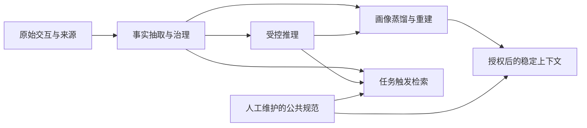

# 统一记忆服务后续开发执行计划 V1.0

> 编制日期：2026-09-27  
> 状态：P01、P02 已完成，P02 已通过用户人工核验；交付与进度依据见第 14.4、14.5 节  
> 当前建议：下一批进入 P03 治理任务执行，再建设画像及服务接口  
> 建设顺序：可靠执行 → 事实与作用域治理 → 治理任务闭环 → 结构化画像 → 服务接口 → 业务验证 → 受控推理 → Agent 经验

## 1. 目标与依据

本计划承接当前 Add、事实抽取和基础领域函数，完成总体方案第一阶段的用户长期记忆闭环，随后增强记忆推理和 Agent 经验资产化。

设计依据：

- [总体设计方案 V2.3](./统一记忆服务总体设计方案_领导汇报版_V2.3.md)：业务定位、三类记忆、首期建设范围与阶段目标。
- [数据模型详细设计规范 V1.0（冻结版）](./统一记忆服务数据模型详细设计规范-V1.0-冻结版.md)：事实、推断、画像、证据、生命周期及任务契约。
- [对话接入与抽取触发方案](./MemoryCMIC-对话接入与抽取触发方案-最终版.md)：Add、历史组织、抽取范围与结果返回约束。
- [ADD 接口运行说明](./ADD接口运行说明.md)：当前已经交付的接口及明确未包含的能力。

第一阶段验收目标：跨会话持续、跨业务受控共享、按任务正确使用；包括用户事实、稳定画像、公共记忆分域、查询与修改删除、基础插件以及 1～2 个业务 Agent 验证。

受控推理属于增强能力，不作为第一阶段闭环的强制前置条件。画像可以直接从有效事实生成，不必等待推理模块完成。

## 2. 当前基线与审查结果

2026-09-27 审查时，现有测试结果为 `72 passed`，`ruff check src tests` 通过。数据库测试在沙箱外连接本地测试 PostgreSQL 执行。事实 Worker 测试使用 FakeFactModel/FakeEmbedder，因此这些结果证明工程行为，不能证明真实模型抽取质量。

| 能力 | 当前状态 | 主要代码与缺口 |
| --- | --- | --- |
| Add 接入 | 最小闭环已实现 | `api.py`、`api_schemas.py`、`ingest.py`；包含校验、鉴权、幂等、来源、任务和回执 |
| 用户事实抽取 | 基础实现已完成 | `providers.py`、`worker.py`；有目标/历史分离、证据、时间及向量；缺范围识别与长输入切片 |
| 在线去重 | 已实现 | 规范化哈希、向量候选、模型判重及补充证据；未按业务/项目范围区分 |
| 生命周期治理 | 领域函数已实现，服务闭环未完成 | `lifecycle.py`；有证据组检查、递归失效、TTL 过滤及任务入队；缺实际任务消费和外部管理接口 |
| 推理生成 | 未实现 | 已有 `inference`、`derives` 和任务定义；没有生成 Worker |
| 画像生成 | 未实现 | 已有 `ProfileProperty`、属性替换、`profile_basis` 和失效传播；没有计算与重建 Worker |
| 检索服务 | 内部函数已实现 | `retrieval.py`；有范围过滤和向量排序，缺对外 Search 与服务端共享授权 |
| 公共记忆服务 | 数据模型支持，业务入口未实现 | 已有 company 主体，缺受控发布、维护和读取入口 |
| 插件与 Agent 验证 | 未完成 | 尚未形成 V2.3 要求的业务使用闭环 |

必须优先处理的审查发现：

以下为实施前的审查记录；第 1、3、5 项已由 P01 处理，第 2、4 项仍由后续批次交付。

1. `worker.run_once` 按事实任务选择租户，但 `claim_tasks` 不按类型限制领取。同租户混合队列可能把其他任务交给事实处理器。
2. Add 抽取结果未设置业务/项目范围，空范围按检索语义成为通用记忆；去重未区分范围，存在误共享和误合并风险。
3. provider 只校验证据 ID 属于目标消息，没有程序化校验用户角色。模拟模型仅引用 assistant 消息时，当前校验仍接受该事实。
4. `vector_delete`、`dependency_recheck`、`profile_rebuild` 等已有入队逻辑，尚无完整执行器；自动纠正、替代和争议处理缺失。
5. Worker 使用 180 秒租约，尚未调用续租；提交前也需复核模型调用期间可能变化的来源、版本和候选状态。

既有数据模型验证报告中的 GO 仅表示可以进入核心服务开发，不表示总体方案或生产上线已经验收。

## 3. 实现原则与模块边界

### 3.1 分层记忆形成



- 事实：用户明确陈述或确认的信息，包含稳定事实、明确偏好、长期要求及项目/任务事项；必须有来源。
- 推断：由事实形成的结论或倾向，保存在 `memory_item(cognitive_type=inference)`；必须与事实区分，并建立 `derives` 关系。
- 画像：有效事实或推断的当前结构化投影，保存在 `profile_property`；每个属性必须有 `profile_basis`。
- 项目角色、任务进度和决策保留为记忆，不进入稳定画像；冻结画像模型没有项目作用域，不擅自添加。
- 公开发布的组织规范属于 company 公共记忆，不从普通用户对话自动升级为公共内容。

### 3.2 保持现有契约

- 沿用 PostgreSQL、现有表结构、证据组及任务队列；仅在验收发现明确缺口时增加必要 migration。
- 不引入新的消息队列、图数据库、通用工作流平台或多轮自主推理框架。
- Add 不要求业务增加 `business_domain`、`project_id`。`source_system` 仅标识来源，不与业务域关联；候选业务标签只由适用场景推断；communication、email、disk 为初始标准标签，允许抽取其他场景并做同义归一化。项目字段暂不赋值，项目相关记忆保留正文限定及内部项目上下文，不因缺少项目 ID 跳过。
- 业务来源与适用范围不同：邮件中形成的信息不一定只适用于邮件，也不能默认跨业务通用。
- 授权与作用域分开校验；模型输出和请求正文均不能授予访问权限。
- 首版画像使用业务需要的有限属性集合，不构建任意属性扩展平台。
- 治理可在内部表达补证据、替代、争议等决定；当前 Add 回执只允许 `event=ADD`，不能未经接口设计变更直接返回 UPDATE/DELETE。
- 删除先落实停止使用与派生失效；原始来源保留、逻辑删除和物理清除的边界在管理接口实施前明确。

## 4. 批次总览

| 批次 | 交付内容 | 前置条件 | 状态 | 阶段归属 |
| --- | --- | --- | --- | --- |
| P01 | 任务类型隔离、租约与提交安全、事实证据校验 | 当前基线 | 已完成 | 第一阶段基础 |
| P02 | 作用域识别、事实纠正与冲突治理、长输入切片 | P01 | 已完成，人工核验通过 | 第一阶段基础 |
| P03 | 向量、TTL 和依赖治理任务执行 | P01、P02 的版本与治理契约 | 未开始 | 第一阶段基础 |
| P04 | 结构化画像生成、聚合触发及重建 | P02、P03 | 未开始 | 第一阶段核心 |
| P05 | Search、画像读取、修改删除及公共记忆入口 | P02、P03；画像接口依赖 P04 | 未开始 | 第一阶段核心 |
| P06 | 基础插件、上下文应用及 1～2 个 Agent 验证 | P04、P05 | 未开始 | 第一阶段验收 |
| P07 | 受控记忆推理与派生治理 | P02、P03；读取复用 P05 | 未开始 | 增强能力 |
| P08 | Agent 执行案例和人工经验资产化 | 第一阶段验收通过 | 未开始 | 第二阶段 |

P05 的接口设计可在 P04 开发时开展。P07 不阻塞 P06；若业务验证证明推理有明确价值，可在 P03 后启动，但不得挤占首期接口与业务闭环。

不预设完成日期。各批次开始前，根据接口决策、外部身份/项目目录和真实模型评估条件估算工作量，再记录实际进度。

## 5. P01：可靠执行与证据校验

目标：所有任务只能由支持该类型的处理器执行，模型调用期间的租约和输入变更不能造成错误提交。

实施内容：

1. 让任务领取明确限制支持的类型，或采用显式类型分发；不支持的任务保持待处理，不能误标失败。
2. 建立租约续期，并保留 worker、lease_token、租约有效性检查；耗时模型调用不能持有数据库事务。
3. 提交前复核目标来源状态/版本、任务输入及引用的重复候选；过时结果不落库，按明确的失效或重试规则处理。
4. 事实证据必须包含目标用户陈述或确认；拒绝仅凭 assistant/system/tool 消息形成用户事实。
5. 保留同会话顺序执行和原有幂等行为；验证失败后的后续批次阻断与恢复路径。

主要改动范围：`task_queue.py`、`worker.py`、`providers.py` 及对应回归测试。

验收：

- 同租户同时存在事实与高优先级清理任务时，不发生任务类型误领。
- 租约续期后长任务可完成；接管后的旧 Worker 不能提交结果。
- 模型调用期间来源失效或版本改变，不生成使用旧来源的 active 事实。
- 仅引用 assistant、system 或 tool 的输出被拒绝；合法用户证据行为不变。
- 原有 Add、任务队列和生命周期测试继续通过。

## 6. P02：事实作用域与简单治理补齐

目标：候选事实成为范围正确、证据明确、可纠正的长期记忆。

2026-09-27 用户澄清并确认：来源与业务域无映射；communication、email、disk 是初始标准场景标签，不是封闭枚举。项目仅预留意味着首版不绑定项目 ID、不写 project_domains，仍生产有效项目记忆；正文及内部上下文保留项目限定，不能推广成通用要求。

实施内容：

1. 定义 communication（短信、电话等非邮件通信）、email（邮件读写、处理和管理）、disk（个人云盘备份、云端文件存储、管理、权限和分享）的受控词表；不得从来源或内容主题直接推导适用标签。
2. 扩展结构化候选，包含必要的业务/项目范围与时间信息；服务端校验模型输出。
3. 项目字段暂时预留，不解析或赋值项目 ID；保留项目相关记忆，在正文及 metadata 的 project_context 中保留限定条件，防止跨项目误合并。
4. 去重候选按主体及真实适用条件约束；初始标签别名归一化，新场景标签结合语义治理，不能只按字符串判断同范围；不同项目或场景的相同文本不能无条件合并。
5. 在现有判重上增加最小治理决定：新增、重复补证据、明确纠正/时间更新、未能裁决的争议。
6. 明确纠正时保存新记忆并通过 `supersedes_id` 关联旧记忆，旧记忆退出 active；不能把一般补充或不同时段事实误判为冲突。
7. 采用 `conflict_group_id`、`disputed` 表达无法裁决的同范围冲突，并明确退出正常检索的对象及恢复条件。
8. 按接入方案实现基于模型预算的切片、上下文截断和切片进度；验证重试不重复已提交片以及 partial 的返回语义。
9. 记忆、证据、状态、任务进度和审计在相应短事务内提交；不增加无需求的公开诊断接口。

主要改动范围：`providers.py`、`worker.py`、`repositories.py`、`settings.py`；仅按实际需要调整任务 payload 或 migration。

验收案例：

| 输入/场景 | 预期结果 |
| --- | --- |
| “邮件回复简洁，项目方案详细说明” | 分别保留 email 邮件偏好和新的方案编写场景偏好，不遗漏、不合并为全局偏好 |
| 相同事实在相同范围重复出现 | 不新增记忆，增加独立证据组 |
| 相同文本分别属于两个项目 | 两条均保留，project_domains 不赋值，正文及内部上下文分别保留项目条件，不跨项目误合并 |
| 项目名称未知或歧义 | 保留能够独立理解的陈述和原项目限定，不猜 ID；指代确实无法理解时不虚构内容 |
| “之前说错了，我现在住上海” | 明确替代旧事实，旧事实及受影响派生退出使用 |
| “去年住北京，今年住上海” | 保留必要时间语义，不把不同时间事实一律视为争议 |
| 大批输入中途失败后重试 | 已提交切片不重复，未完成部分继续处理；回执符合契约 |

本批同时建立真实模型评估集，覆盖无长期价值、指代确认、assistant 误归属、纠正、范围和时间场景。

## 7. P03：治理任务执行闭环

目标：从“失效并入队”推进到实际清理、复核与更新完成。

实施内容：

- `vector_upsert`：根据当前内容、版本和 model_id 生成向量，内容未变不重复计算，旧任务不能覆盖新内容。
- `vector_delete`：按记忆和模型清理派生向量，避免迟到删除任务误删已更新的有效向量。
- `ttl_expire`：扫描已到期 active 记忆并幂等执行过期治理；在线检索继续即时排除过期数据。
- `dependency_recheck`：复用证据组 AND/OR 和版本校验，完成必要重检；剩余证据不足时维持失效，不无条件恢复。
- 明确各处理器的完成、重试和终态条件；任务与审计保留 correlation_id。
- 为下一批画像重建提供可靠的任务分发入口，画像算法本身在 P04 实现。

主要改动范围：`worker.py`、`task_queue.py`、`lifecycle.py`，按职责添加必要的小型处理模块。

验收：来源删除后事实立即不可检索；清理任务可完成；仍存在独立充分证据的记忆保持有效；TTL 任务重复执行无重复副作用；过时任务不能改变当前派生状态。

## 8. P04：画像蒸馏与重建

目标：由有效事实形成稳定、结构化、可追溯的用户画像，供高频读取。

实施内容：

1. 以业务实际使用的少量属性开始，例如称呼、邮件表达偏好、长期输出要求；先明确 property_key、value_type 和冲突规则。
2. 消费 `profile_rebuild`，兼容按用户重建和现有属性失效任务；复用现有类型，不增加来源专用任务类型。
3. 仅使用同租户、同用户、授权及适用范围匹配、active 且未到期的依据记忆。
4. 首版直接使用明确事实；P07 完成后才纳入满足条件的推断，不能提前把模型猜测混入画像。
5. 原子提交画像属性、`profile_basis` 证据、版本替换与审计；复核依据版本及证据充分性。
6. 在事实新增、纠正、删除和过期时触发受影响用户重建；按用户及稳定水位合并，避免每条事实单独重建。
7. 无证据的旧属性保持失效或不再输出，不能通过历史画像内容自证后恢复。
8. 读取画像时同时过滤状态、TTL 和范围，并补充依据有效性的必要检查。

主要改动范围：新增画像计算模块，修改 `worker.py`、`repositories.py`、`lifecycle.py` 与事实提交后的任务触发。

验收：

- “以后邮件回复简洁”形成对应业务画像，并可追溯到事实和原始消息。
- 项目角色和任务状态不进入稳定画像。
- 多条新增事实合并触发用户重建；重复任务不新增同一有效属性。
- 明确修改偏好后旧值退出使用；来源删除、事实失效或到期后旧画像不能继续输出。
- 仅当仍有充分依据时保留属性；过时重建不能覆盖新结果。
- 完成 `profile_rebuild → profile_property + profile_basis` 真实执行的端到端测试，而非仅加载预置画像。

## 9. P05：查询、管理与公共记忆服务

目标：提供 Agent 可调用、用户可管理的第一阶段 API 闭环。

实施前先完成短接口设计：请求/响应、统一用户映射、业务/项目授权来源、跨业务共享规则、错误码和删除语义。现有凭证仅限制来源写入，不能直接充当完整用户读写授权。

实施内容：

1. Search：接收任务查询，服务端推导或校验可访问主体及范围，生成查询向量并复用内部检索。
2. 画像读取：返回当前可用结构化属性及必要的来源信息，为稳定上下文提供入口。
3. 记忆列表/详情：在授权范围内展示记忆内容、状态、适用范围及来源，支撑“系统记住了什么”。
4. 修改：明确用户修改的优先级和来源，保留版本、替代关系及审计，触发派生更新；不无来源覆盖。
5. 删除：立即停止使用并传播到推断、画像和向量；验证同一来源不会通过后台任务意外恢复被主动删除的记忆。
6. 记忆关闭/采集开关：建立最小可用入口，并说明关闭对新增采集、读取及已有记忆的影响。
7. 公共记忆：支持有权限的维护者发布、修改和下线 company 规范/术语，区分组织归属与业务适用范围；普通用户或 Agent 无公共发布权限。
8. 首版复用向量检索；当真实评估证明术语、精确文本等场景存在召回缺口时，补充 PostgreSQL 全文或关键词召回及简单融合排序。

候选 API 类别：Search、Profile、Memory List/Detail、Update/Delete、Memory Settings、Public Memory Management。具体路径及 DTO 在本批接口设计中确认，不把本计划的类别视为已冻结协议。

验收：

- 跨租户、跨用户、未授权业务/项目和未授权组织记忆均不能读取或修改。
- 授权参数不能由正文绕过；默认拒绝无明确授权的访问。
- 用户可查看、修改、删除或关闭相关记忆；派生结果随管理操作正确变化。
- 公司规范可受控发布、更新及下线；检索不返回失效规范。
- 同一 API 路径覆盖事实和后续推断检索，不为推理建立另一套记忆协议。

## 10. P06：基础插件与第一阶段业务验收

目标：用真实业务证明记忆形成、管理、检索及使用闭环。

实施内容：

- 选择一个实际宿主框架提供基础插件，使用可用消息钩子提交用户输入或问答；排除内部思考、旧记忆注入和未完成流式内容。
- 提供该插件的最小 CLI 安装/配置入口，复用现有 Add/Search 协议。
- 在任务前读取授权后的稳定画像和必要公共规范；按任务触发检索。
- 由业务 Agent 判断记忆的必要性和适用性，按上下文预算装配；避免把所有候选直接注入。
- 接入 1～2 个业务 Agent；优先选择可验证范围差异的业务，例如邮件与云盘。
- 记录事实准确率、范围错误、旧记忆干扰、画像有效性、模型调用成本与任务效果；评估数据使用虚构或已获授权内容。

验收场景：跨会话继续项目任务、授权后共享通用用户事实、业务偏好不误用、项目信息不越界、修改删除即时生效、公共规范正确应用、相关但不适用的候选被 Agent 拒用。

第一阶段完成门槛：P01～P06 验收通过，真实模型评估完成，至少一个业务 Agent 完成闭环且 1～2 个 Agent 的接入目标有明确结果记录。单 Agent 验证不能代替跨业务共享验收。

生产上线所需的容量、时延、运行监控和运维条件另行按业务目标验收；本计划不将 72 项测试或小规模冒烟视为生产 SLA。

## 11. P07：受控记忆推理

目标：在明确业务价值的场景中，从有效事实形成可解释推断。

实施内容：

1. 消费 `inference_derive`，首版采用一次结构化生成与严格校验，不复制多轮自主探索框架。
2. 从同用户、适用范围兼容的有效事实中选取依据；输出结论、依据 ID、置信度、时间和范围。
3. 存储 `memory_item(cognitive_type=inference)` 与 `derives` 关系，继承现有证据组语义。
4. 推断适用范围不能超出依据和授权支持的范围；跨业务推断不能默认提升为通用画像。
5. 依据不足、冲突或没有长期使用价值时不生成；重复转述同一来源不作为多份独立证据。
6. 首版限制从事实派生，不无限递归生成推断；后续画像仅使用经规则允许的推断。
7. 依据变化时立即失效并重检；Search 返回可区分的类型、置信度及依据，业务 Agent 按需使用。

验收：多条独立证据支持的表达倾向生成推断；单次偶发行为不直接形成稳定倾向；用户明确事实与推断分开；依据删除后结论停止使用；过时推理任务不能写入新版本。

完成条件：与仅使用事实的基线比较，证明选定场景有收益，且错误归纳和范围扩张满足开始本批时确定的质量门槛。

## 12. P08：Agent 经验资产化

目标：按 V2.3 第二阶段，把执行案例和人工总结转化为可复用经验。

首批交付：

- 保存执行案例及人工经验，明确 Agent 归属、业务/任务适用范围、成功失败信息和来源。
- 按 Skill/任务组织并检索经验，支持专家审核发布、版本及下线。
- Agent 使用经验后记录必要效果反馈，验证经验适用性和可复用价值。
- 默认不跨 Agent 共享，通过服务端授权开放特定共享范围。

开始前明确执行案例到冻结模型的最小映射；如现有 `skill`/`rule` 无法表达必要信息，先提交有触发场景的模型调整，不强行伪装成用户事实。

首批不实现自动经验学习、复杂反思、多 Agent 自主协作、组织知识目录或全面自动优化。

验收：专家经验可发布并按任务召回，其他未授权 Agent 无法使用，下线/更新影响后续检索，案例和经验可以溯源并记录效果。

## 13. 参考源码及使用方式

本机实际目录为 `/home/zhongdixiu/codes/mem0`、`/home/zhongdixiu/codes/EverOS`、`/home/zhongdixiu/codes/honcho`，其中 mem0、honcho 使用小写目录名。

| 参考实现 | 源码位置 | 用途与边界 |
| --- | --- | --- |
| Mem0 事实写入 | [memory/main.py](../../mem0/mem0/memory/main.py) | 候选抽取、已有记忆召回和写入组织；当前 checkout 主抽取采用 ADD-only 与关联，不推断其已启用自动替代 |
| Mem0 治理提示 | [configs/prompts.py](../../mem0/mem0/configs/prompts.py) | 借鉴新增、更新、删除、不变的判断提示，映射为本项目的版本与证据治理 |
| EverOS 原子事实 | [extract_atomic_facts.py](../../EverOS/src/everos/memory/strategies/extract_atomic_facts.py) | 异步派生事实策略；不强制引入 episode 作为本项目新主存储层 |
| EverOS 画像 | [extract_user_profile.py](../../EverOS/src/everos/memory/strategies/extract_user_profile.py) | 事件触发、输入选取、节流和画像更新；不迁入 Markdown/LanceDB 存储体系 |
| EverOS Agent 经验 | [extract_agent_case.py](../../EverOS/src/everos/memory/strategies/extract_agent_case.py)、[extract_agent_skill.py](../../EverOS/src/everos/memory/strategies/extract_agent_skill.py) | P08 的案例与 Skill 形成参考；自动聚类和自动提炼留待验证后推进 |
| Honcho 事实提取 | [deriver.py](../../honcho/src/deriver/deriver.py)、[prompts.py](../../honcho/src/deriver/prompts.py) | 目标主体归属和明确事实抽取 |
| Honcho 推理 | [specialists.py](../../honcho/src/dreamer/specialists.py)、[orchestrator.py](../../honcho/src/dreamer/orchestrator.py) | 演绎、归纳与依据关联；首版不复制其完整自主探索机制 |
| Honcho 画像重建 | [CardRefreshSpecialist](../../honcho/src/dreamer/specialists.py) | 删除后从剩余依据重建的原则；本项目落地为结构化属性及 profile_basis |

参考项目只是实现资料，本项目行为以 V2.3、冻结模型及本项目接口契约为准。外部文本画像不直接替代结构化 `ProfileProperty`。

## 14. 验证与进度维护

每批执行顺序：先给出目标与验收案例 → 复现相关缺口或建立必要验证 → 最小实现 → 针对性检查 → 更新本文件。

### 14.1 测试要求

- P01～P03：优先补任务误领、租约、来源变更、范围去重、纠正及清理的回归测试。
- P04：测试真实任务生成画像和证据，不以预置数据替代 Worker 验收。
- P05～P06：覆盖权限、修改删除、公共发布和业务端到端使用。
- P07：工程测试之外，与事实基线进行真实模型质量比较。
- 未涉及外部模型的测试使用 Fake provider；真实模型评估独立运行，记录模型、prompt 版本、样本与结果。
- 开始真实模型评估前确认使用环境、样本授权、调用成本和质量门槛，不能用未定义指标宣称通过。

常规检查示例：

```bash
# 已在当前 shell 配置测试数据库连接；不要输出或提交凭证。
.venv/bin/pytest -q tests/test_add_api.py tests/test_add_worker.py tests/test_task_queue.py
.venv/bin/ruff check src tests
```

仅在改动数据库模型时追加 migration upgrade、`alembic check` 和结构约束测试。涉及共用队列、生命周期或接口契约时执行全套现有测试；检查通过后无新变化不重复扩大验证。

### 14.2 实施前决策与外部依赖

| 项目 | 最晚确定批次 | 决策要求 |
| --- | --- | --- |
| 场景标签、项目字段 | P02 | 已确认三类初始标准场景标签并允许扩展，与来源无映射；项目字段不赋值，保留项目记忆和正文限定 |
| 替代/争议与恢复规则 | P02 | 对同范围、时间变化、补充和明确纠正分别定义行为 |
| 首版画像属性和冲突优先级 | P04 | 由实际业务使用确定有限属性，不凭空扩展 |
| 用户授权与跨业务共享 | P05 | 明确身份映射、授权来源及撤销行为；不能由模型决定 |
| 管理删除与原始来源保留 | P05 | 明确逻辑删除、物理清除、重建及重新接入的边界 |
| 插件宿主和业务 Agent | P06 | 选择实际可用消息钩子及业务验证负责人 |
| 模型质量与业务效果门槛 | P02/P06/P07 | 开始评估前确定指标与通过标准 |

会影响行为、接口、数据或授权边界的未决事项必须在相关实施前澄清；其他独立工作继续推进，不因可后置决策停止整批开发。

### 14.3 每批完成记录模板

```text
批次：
状态：未开始 / 执行中 / 已完成 / 阻塞 / 需修订
开始及完成日期：
实际交付与改动文件：
验收案例及结果：
执行命令与测试结果：
真实模型评估结果（如适用）：
设计偏差、外部依赖和未决问题：
下一批开始条件：
```

只有交付物落地、该批验收通过且阻塞已明确处理时，才能标记已完成。部分完成必须记录剩余工作；缺少权限或外部依赖时报告实际阻塞，不将计划内容填写成完成结果。

### 14.4 P01 完成记录

- 批次：P01，已完成；开始及完成日期：2026-09-27。
- 实际交付：
  - `task_queue.py`：领取支持按 `task_types` 过滤；空集合不领取。事实 Worker 只领取 `fact_extract`，高优先级清理任务保持 pending。未指定类型的队列调用保持原有行为。
  - `task_queue.py`、`worker.py`：以独立短事务每 60 秒续期默认 180 秒租约；续租检查 worker、lease_token 和实际租约有效性，到期时间以当前时刻计算，避免反复续租累积过长租约。提交在持有任务锁时再次校验 token，并用 `clock_timestamp()` 防止事务开始时尚有效、提交时已过期的租约通过检查。模型调用不持有数据库事务。
  - `worker.py`：记录任务身份、payload/input_version、来源版本和消息、来源关联及历史输入快照；提交事务锁定任务、关联与来源后重新加载比较。引用的重复候选复核租户、用户、类型、状态、TTL、版本和内容，并锁定后补证据；提交时的精确哈希去重同样排除过期候选。
  - `providers.py`、`worker.py`：共同校验证据只能引用 target，且至少包含一个 target user 消息；仅 assistant/system/tool 的候选拒绝。允许用户确认与 assistant 上下文联合形成证据。
  - `tests/test_add_worker.py`、`tests/test_task_queue.py`、新增 `tests/test_providers.py`：新增 23 项回归测试。
- 失效与重试规则：来源不可用、版本或任务输入改变，以 `INPUT_PROCESSING_FAILED` 终态失败且不写结果；重复候选变化或证据输出非法，以 `EXTRACTION_FAILED` 按既有次数和退避规则重试。租约丢失时旧 Worker 不改变接管后的任务及结果。
- 验收案例及结果：混合任务不误领；长模型调用续租后完成；同 worker ID 换 token 接管后旧续租、旧完成和旧事实提交均被拒绝；来源失效/版本变化、任务 payload/关联变化均无事实落库；重复候选版本/状态/内容/TTL 变化重试且不补旧证据；非用户独立证据拒绝，用户确认及原有 Add/去重合法路径通过；提交期间租约到期时事实、证据、向量、抽取审计和来源处理进度全部回滚。
- 顺序及恢复：保持既有同会话顺序约束；前序终态失败时后续批次返回 `PRIOR_TASK_FAILED`。回归测试验证内部修复后将任务重置 pending、清空租约/终态信息并依次重跑可恢复；未新增公开重试或管理接口。
- 执行命令与结果：加载本地 `.env`（不输出凭证），沙箱外连接本地 PostgreSQL 执行 `.venv/bin/pytest -q`，结果 `95 passed`；`.venv/bin/ruff check src tests` 与 `git diff --check` 通过。测试有 36 条既有依赖弃用告警。
- 真实模型评估：本批不调用真实模型；Worker 使用 Fake provider，Qwen 输出校验测试模拟结构化响应，结果仅证明工程行为。
- 设计偏差、外部依赖和未决问题：无 schema/migration 变更；沙箱内数据库连接无法完成，已改用获准的沙箱外测试并终止等待中的进程；无 P01 未完成项。P02 的作用域识别及事实治理仍未交付。
- 下一批开始条件：明确来源业务映射、可靠项目 ID 解析及替代/争议恢复规则，再实施 P02；真实模型评估前确定环境、样本授权、成本与质量门槛。

### 14.5 P02 实施与验收记录

- 批次：P02，已完成；用户于 2026-09-27 确认人工核验通过，依据见 [验收记录](../reports/p02_acceptance.md)。
- 已确认的需求：source_system 与适用场景无关联；communication、email、disk 为初始标准标签，允许其他场景。项目目录及 ID 绑定暂不实现，project_domains 不赋值，但项目记忆正常生产；正文和 metadata.project_context 保留项目条件。此前“项目候选全部跳过”和“只允许三个业务标签”是 Codex 的需求误解，旧 p02-v4 的 16/16 结论不能代表当前需求通过。
- 实际交付：
  - `providers.py`：开放场景标签，初始别名归一化、非空及数据库长度校验；结构化项目上下文、时间和变更意图；正文必须保留项目上下文。抽取提示要求保留未知/重名项目的自足要求，不将未解析项目 ID 误判为业务范围未知。治理提示结合场景语义及项目条件比较，同义标签不因字符串不同而强制新增。
  - `worker.py`：project_domains 保持 NULL，项目上下文存入 metadata；不同项目上下文不进入相互治理，同项目重复补证据。通用与限定场景区分，三个初始标准场景不同不误合并，其他场景候选交给模型判定真实适用条件；精确快捷去重仍要求标签一致。提交前复核来源、任务输入和候选快照，用户锁防止并发写入；同片新增候选参与后续治理；记忆、证据、审计、结果与进度同事务提交。
  - `retrieval.py`：保留原精确场景检索并归一化初始别名；该路径排除尚未绑定 ID 的项目限定记忆。新增内部语义适用性路径，需同时提供任务 query 和 applicability_model；授权主体、租户、状态、TTL、已绑定项目 ID 条件仍由数据库过滤，场景标签作为语义线索，模型根据正文和项目上下文筛选，不能返回候选外 ID。查询缺少项目上下文时不将项目记忆当作通用要求；尚未新增公开 Search 接口。
  - `lifecycle.py`：明确纠正/更新替代，未解决矛盾形成争议组；旧向量 stale，派生同步失效并入队；只有明确澄清解决争议，不复活旧派生。
  - `extraction_input.py`、`settings.py`、`.env.example`：长输入按预算分片、保留字符位置，关联及近历史优先；UTF-8 字节保守估算；默认输入 12000、输出预留 2048。输出截断最多连续拆分两轮，每任务默认累计 20 个抽取/治理请求及 embedding 批次，失败调用计数。
  - `task_queue.py`、`worker.py`：冻结首次输入、切片、预算、prompt 版本及进度；重试继续未提交片，全部片完成才标来源处理版本。公共 pending 隐藏中间结果；最终失败有已提交记忆/证据则 partial，否则 failed；证据-only partial 可以没有结果。
  - 测试新增项目记忆保留、不同项目不重复/替代/争议、同项目重复补证据、开放场景及同义治理、项目语义检索与候选外 ID 拒绝；原范围、纠正、时间、预算、切片和 P01 租约回归保留。
- 工程验证：全套 `137 passed`，37 条依赖弃用告警；`ruff check src tests scripts/evaluate_p02.py` 和 `git diff --check` 通过。无 schema/migration 变更。
- 真实评估结果：最终 `p02-v6` 18/18 经 Codex 语义审查通过，误归属、范围错误、错误替代均为 0；项目查询适用性 3/3 通过，已生成向量均 1024 维。`p02-v5` 的未知/重名项目误跳过及方案偏好遗漏已保留失败输出并修正。
- 真实评估范围：Qwen `qwen3.8-max`、SiliconFlow `BAAI/bge-m3`；18 个虚构案例，包含原 16 个修正预期、同义新场景、不同项目要求；额外检查星河项目、远山项目与日常邮件三个查询的适用性。真实调用验证 provider 和服务端证据/治理校验，数据库提交与恢复仍由 Fake provider 工程回归验证，不声称真实模型数据库端到端运行。
- 设计边界：项目上下文是文本条件，不是唯一项目 ID 或授权依据；同名项目仍需未来目录/可信上下文解决，当前治理对不同项目上下文保守分开。新场景同义判定及任务适用性依赖模型；语义检索只判断候选窗口（向量排序优先，无向量时按 ID 取有限候选），不保证全量召回。当前项目字段不赋值，不提供项目权限推断。公开回执 ADD-only；已完成任务重放不会强制重处理；P03 治理消费及 P04 画像重建仍未实现。
- 人工验收：用户于 2026-09-27 明确确认“好的，我核验过了，没问题”；修正后输出核验通过。质量门槛为误归属、范围错误、错误替代均 0，其余至少 90%；P02 无剩余验收项。

当前下一步：进入 P03，消费已入队的向量与依赖治理任务。
