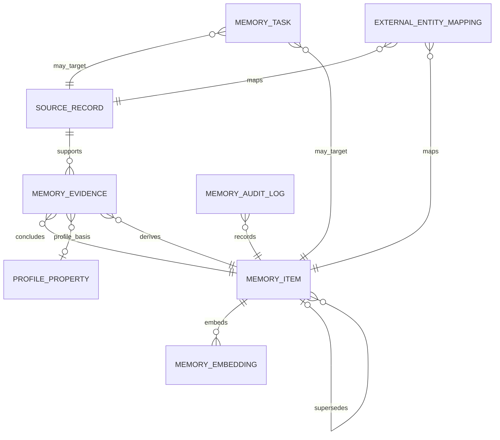
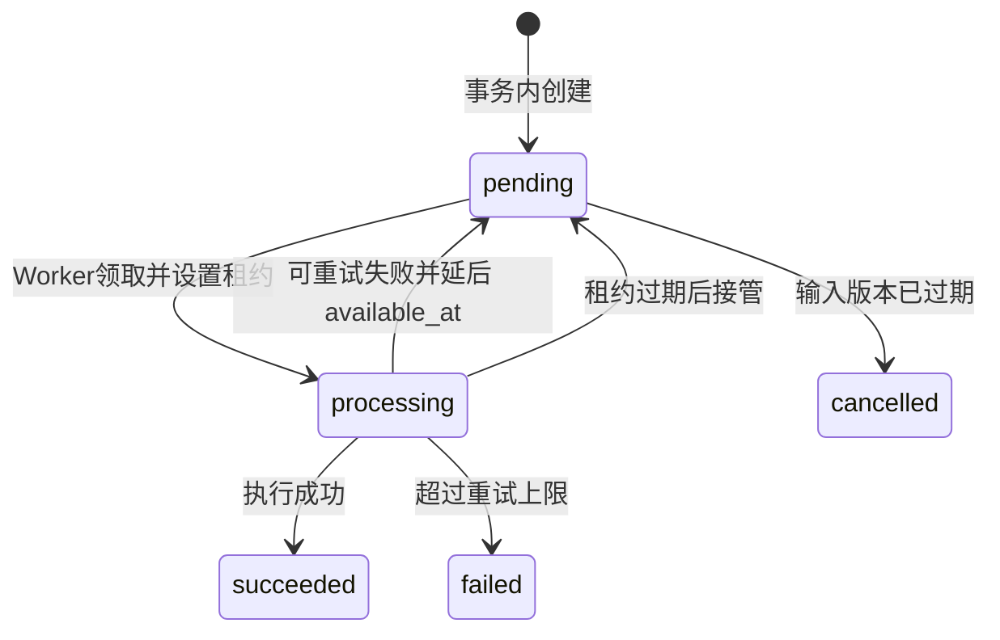
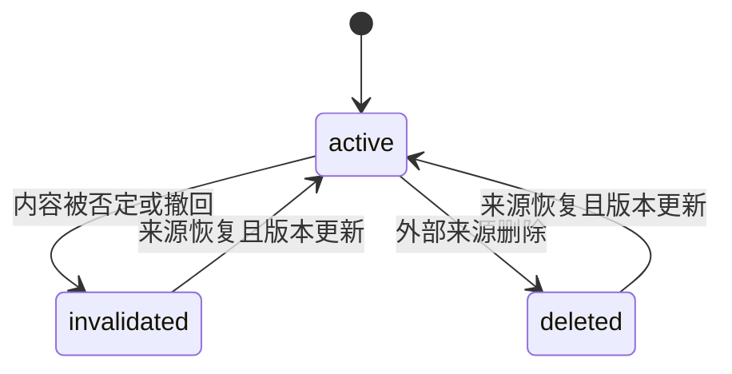
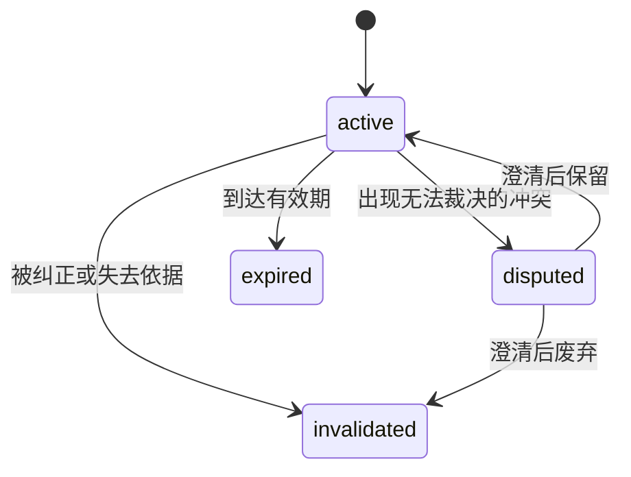
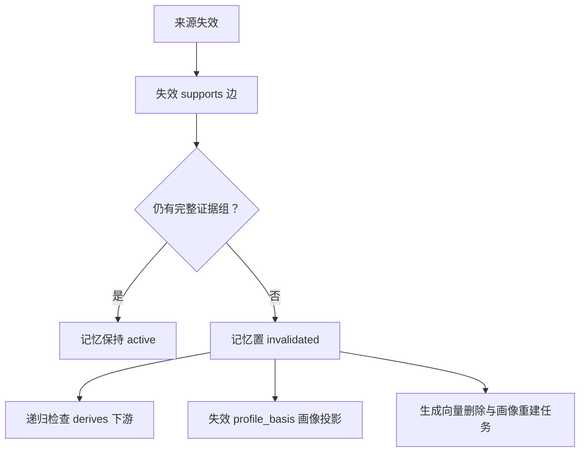
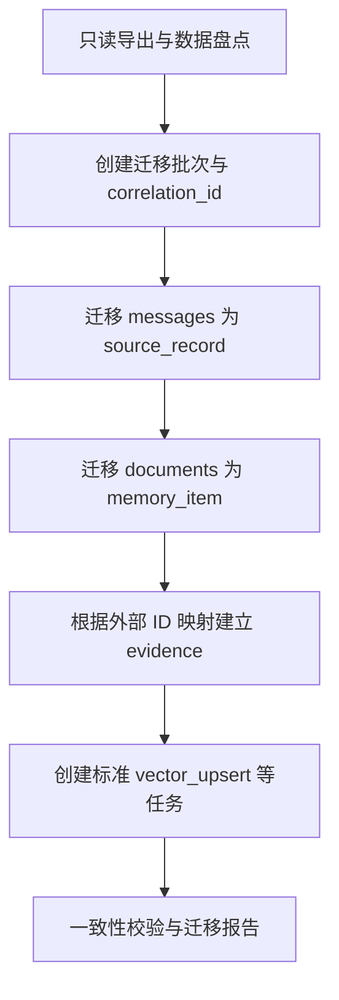

# 统一记忆服务数据模型详细设计规范 V1.0（冻结版）

> 文档状态：Frozen  
> 版本：V1.0  
> 冻结日期：2026-09-20  
> 适用阶段：统一记忆服务 MVP、Honcho 历史数据迁移、核心功能工程开发  
> 数据库基线：PostgreSQL 15+、pgvector

## 冻结修订记录

| 日期 | 修订内容 |
| --- | --- |
| 2026-09-20 | 冻结 V1.0 主体、范围、来源、记忆、画像、向量、任务、审计与 Honcho 迁移模型 |
| 2026-09-20 | 补充 `evidence_group_id` 的组内 AND、组间 OR 语义；将 `projects` 更名为 `profile_basis` |
| 2026-09-20 | 明确异步任务的关联 ID、三级优先级、执行租约和 Worker 领取规则 |
| 2026-09-20 | 移除运行期 `legacy_migrate`，将迁移映射表通用化为 `external_entity_mapping` |

---

## 1. 文档目的

本规范冻结统一记忆服务首期数据模型，作为以下工作的共同基线：

1. 编写 PostgreSQL DDL 与数据库 migration；
2. 实现来源接入、记忆形成、分域检索和生命周期管理；
3. 验证多来源支撑、冲突纠正、TTL、级联失效和异步一致性；
4. 迁移现有 Honcho 历史消息与记忆数据；
5. 为 Email Agent、OpenClaw 等业务 Agent 提供统一存储与检索能力。

冻结表示 V1.0 的核心语义和表职责不再随意变更。后续调整必须通过版本化 migration 和设计决策记录进行，不直接修改已上线字段含义。

---

## 2. V1.0 设计范围

### 2.1 首期支持

- 用户事实、推断偏好、画像属性；
- Agent 执行规程与人工总结经验；
- 企业公共规范与统一口径；
- 对话、文档、工具结果等原始来源记录；
- 一条记忆由多个来源共同支撑；
- 事实到推断、事实或推断到画像的依赖关系；
- 用户、业务域、项目域范围过滤；
- 来源失效、TTL 到期、记忆纠正、争议和替代；
- 向量生成、删除和重建；
- 异步任务幂等、重试、锁接管和版本防覆盖；
- 关键变更审计；
- Honcho 历史消息、Document 和来源关系迁移。

### 2.2 首期不支持

- 通用人物、组织、地点知识图谱；
- 一条记忆精确绑定“业务域—项目域”的指定组合；
- Agent 私有记忆空间；
- 在数据表内维护 Agent 授权清单；
- 物理冷归档和跨存储介质迁移；
- 多种不同向量维度同时在线；
- 跨用户共享项目记忆；
- 自动完成复杂冲突仲裁；
- 将记忆数据库作为联系人、员工、项目等业务主数据的权威来源。

---

## 3. 冻结设计原则

### 3.1 来源、归属、内容对象、适用范围相互独立

系统区分四个概念：

| 概念 | 回答的问题 | V1.0 表达方式 |
| --- | --- | --- |
| 输入者 Author | 谁产生了原始内容 | `source_record.author_type / author_id` |
| 一级归属主体 Subject | 记忆进入谁的记忆空间、默认以谁为检索锚点 | `memory_item.subject_type / subject_id` |
| 内容关联对象 | 记忆内容还提到了谁或什么 | 首期写入 `content`，不建立通用实体表 |
| 适用范围 | 记忆在哪些业务和项目中可用 | `business_domains / project_domains` |

`subject` 不再定义为“内容直接描述的唯一对象”。例如“用户 u1001 的朋友小王喜欢摄影”仍归入用户 u1001 的记忆空间：

```text
subject_type = user
subject_id   = u1001
content      = 用户 u1001 的朋友小王喜欢摄影
```

如果执行发短信、打电话等确定性操作，应通过通讯录等权威业务系统确认联系人 ID 和号码，记忆只提供昵称、关系和历史使用线索。

### 3.2 适用范围与授权解耦

- 数据模型记录记忆自身的业务、项目适用范围；
- Agent 是否有权查询某类记忆由独立授权控制面决定；
- 查询服务先校验调用方授权，再根据本模型执行范围过滤；
- V1.0 不在 `memory_item` 中增加 Agent ACL 或授权关系表。

### 3.3 `NULL` 表示不受范围限制

`business_domains` 和 `project_domains` 均采用数组：

- `NULL`：不受该维度限制；
- 非空数组：仅适用于数组中列出的范围；
- 禁止空数组；
- 数组元素必须去重并按稳定规则排序；
- 不再使用字符串 `common`。

两个数组独立匹配。例如：

```text
business_domains = {email, disk}
project_domains  = {project_a, project_b}
```

表示四种组合都适用。如果未来需要仅允许 `email + project_a`、`disk + project_b`，再增加组合型作用域表，不在 V1.0 预设。

### 3.4 事实与证据分离

- `source_record` 保存外部世界发生过什么；
- `memory_item` 保存服务当前认可和管理的记忆结论；
- `memory_evidence` 保存来源、事实、推断与画像之间的依赖；
- 同一事实被重复表达时，优先追加证据边，不重复创建记忆；
- 删除一个来源不必然删除记忆，必须先判断是否仍有其他有效证据。

### 3.5 在线正确性优先于异步清理

记忆一旦失效或到期，在线检索必须立即排除。向量物理删除、画像重建等可以异步执行，但异步延迟不得导致失效数据继续被使用。

---

## 4. 整体实体关系



V1.0 包含七张运行期核心表和一张迁移辅助表：

| 类型 | 表 |
| --- | --- |
| 核心实体 | `source_record`、`memory_item`、`profile_property` |
| 关系与检索 | `memory_evidence`、`memory_embedding` |
| 运行治理 | `memory_task`、`memory_audit_log` |
| 迁移辅助 | `external_entity_mapping` |

首期不建立 `memory_item_archive`。失效和到期记录继续保留在主表，通过状态和部分索引隔离在线数据。

---

## 5. 标识、租户与通用约束

### 5.1 标识规则

- 主键由应用生成，类型统一为 `VARCHAR(64)`；
- 推荐前缀：`src_`、`mem_`、`evd_`、`prf_`、`tsk_`、`aud_`；
- ID 在系统内全局唯一；
- 所有租户核心表额外建立 `UNIQUE (tenant_id, id)`，供复合外键约束使用。

### 5.2 租户规则

- `tenant_id` 由外部租户或账号体系提供；
- V1.0 不重复建设租户主数据表；
- 所有业务表必须包含 `tenant_id`；
- `tenant_id` 不设置默认值，调用方必须显式传入；
- 所有关联查询和写入必须携带 `tenant_id`；
- 证据和向量关系使用复合外键，阻止跨租户关联。

### 5.3 时间与版本

- 所有业务时间使用 `TIMESTAMP WITH TIME ZONE`；
- `occurred_at` 表示外部事件发生时间；
- `created_at / updated_at` 表示统一记忆服务内的物理时间；
- 可被异步计算覆盖的实体必须包含递增 `version`；
- 异步回写使用 `WHERE version = input_version` 防止旧结果覆盖新状态。

---

## 6. 数据表定义

### 6.1 来源记录表 `source_record`

保存未经记忆归纳的原始输入，是来源删除、更新和证据追溯的基础。

| 字段 | 类型 | 约束 | 含义 |
| --- | --- | --- | --- |
| `id` | VARCHAR(64) | PK | 来源记录 ID |
| `tenant_id` | VARCHAR(64) | NOT NULL | 租户 ID，无默认值 |
| `source_system` | VARCHAR(64) | NOT NULL | 来源系统，如 `email_agent`、`openclaw`、`honcho` |
| `source_type` | VARCHAR(32) | NOT NULL | `chat`、`doc`、`tool`、`manual`、`legacy_import` |
| `session_id` | VARCHAR(128) | NULL | 外部会话或线程 ID |
| `external_ref_id` | VARCHAR(128) | NOT NULL | 来源系统内的记录 ID |
| `author_type` | VARCHAR(32) | NOT NULL | `user`、`agent`、`system`、`admin` |
| `author_id` | VARCHAR(64) | NOT NULL | 输入者业务标识 |
| `raw_content` | TEXT | NOT NULL | 原始文本或序列化内容 |
| `content_hash` | VARCHAR(64) | NOT NULL | 规范化内容哈希，用于变更识别 |
| `metadata` | JSONB | NULL | 附件、文件、工具回执及遗留信息 |
| `status` | VARCHAR(32) | NOT NULL DEFAULT 'active' | `active`、`invalidated`、`deleted` |
| `version` | INTEGER | NOT NULL DEFAULT 1 | 来源内容版本 |
| `occurred_at` | TIMESTAMPTZ | NOT NULL | 外部事件发生时间 |
| `invalidated_at` | TIMESTAMPTZ | NULL | 作废或删除时间 |
| `created_at` | TIMESTAMPTZ | NOT NULL DEFAULT CURRENT_TIMESTAMP | 入库时间 |
| `updated_at` | TIMESTAMPTZ | NOT NULL DEFAULT CURRENT_TIMESTAMP | 更新时间 |

关键约束：

```text
UNIQUE (tenant_id, source_system, source_type, external_ref_id)
UNIQUE (tenant_id, id)
CHECK (version > 0)
```

来源内容更新时更新同一行并递增 `version`；旧版本对应的有效证据边立即失效，再触发相关记忆充分性检查和重新抽取。外部删除不物理删除来源行，而是更新 `status` 和 `invalidated_at`。

### 6.2 记忆实体表 `memory_item`

保存统一记忆服务正式管理的事实、推断、技能经验和公共规范。

| 字段 | 类型 | 约束 | 含义 |
| --- | --- | --- | --- |
| `id` | VARCHAR(64) | PK | 记忆 ID |
| `tenant_id` | VARCHAR(64) | NOT NULL | 租户 ID |
| `subject_type` | VARCHAR(32) | NOT NULL | `user`、`agent`、`company` |
| `subject_id` | VARCHAR(64) | NOT NULL | 一级归属主体或检索锚点 |
| `cognitive_type` | VARCHAR(32) | NOT NULL | `fact`、`inference`、`skill`、`rule` |
| `business_domains` | VARCHAR(32)[] | NULL | 适用业务域；NULL 表示不限制 |
| `project_domains` | VARCHAR(64)[] | NULL | 适用项目域；NULL 表示不限制 |
| `summary` | VARCHAR(512) | NOT NULL | 简明摘要 |
| `content` | TEXT | NOT NULL | 完整记忆内容 |
| `metadata` | JSONB | NULL | 非核心扩展信息及遗留映射信息 |
| `confidence` | NUMERIC(4,3) | NOT NULL DEFAULT 1.000 | 0 至 1 |
| `status` | VARCHAR(32) | NOT NULL DEFAULT 'active' | `active`、`invalidated`、`disputed`、`expired` |
| `version` | INTEGER | NOT NULL DEFAULT 1 | 乐观锁版本 |
| `supersedes_id` | VARCHAR(64) | NULL | 当前记忆替代的旧记忆 ID |
| `conflict_group_id` | VARCHAR(64) | NULL | 同一冲突组标识 |
| `effective_at` | TIMESTAMPTZ | NOT NULL | 开始生效时间 |
| `expired_at` | TIMESTAMPTZ | NULL | 到期时间 |
| `invalidated_at` | TIMESTAMPTZ | NULL | 失效时间 |
| `created_by` | VARCHAR(64) | NOT NULL | 创建者或任务标识 |
| `created_at` | TIMESTAMPTZ | NOT NULL DEFAULT CURRENT_TIMESTAMP | 创建时间 |
| `updated_at` | TIMESTAMPTZ | NOT NULL DEFAULT CURRENT_TIMESTAMP | 更新时间 |

关键约束：

```text
UNIQUE (tenant_id, id)
FOREIGN KEY (tenant_id, supersedes_id)
  REFERENCES memory_item (tenant_id, id)
CHECK (confidence >= 0 AND confidence <= 1)
CHECK (version > 0)
CHECK (business_domains IS NULL OR cardinality(business_domains) > 0)
CHECK (project_domains IS NULL OR cardinality(project_domains) > 0)
```

数组元素去重、排序和非法值校验由写入服务统一执行。数据库只负责禁止空数组。

### 主体使用规则

| `subject_type` | 使用方式 |
| --- | --- |
| `user` | 用户事实、偏好、计划，以及归属于该用户的联系人关系等上下文 |
| `agent` | 以某 Agent 为主要适用对象的执行经验或规程；不表示 Agent 私有权限 |
| `company` | 企业公共规范、统一口径和公共知识 |

### 重复、冲突与替代

- 重复表达：保留一条 `memory_item`，追加新的有效证据边；
- 明确时序纠正：创建新记忆，设置 `supersedes_id`，旧记忆转为 `invalidated`；
- 无法判定的新旧冲突：相关记忆进入同一 `conflict_group_id` 并转为 `disputed`；
- V1.0 不建设通用 `memory_relation` 表。

### 6.3 证据关系表 `memory_evidence`

保存来源到记忆、记忆到记忆、记忆到画像的有向依赖。

为了保留单表结构并建立真实外键，V1.0 不再采用 `upstream_type + upstream_id` 多态字段，而采用四个可空外键配合互斥约束。

| 字段 | 类型 | 约束 | 含义 |
| --- | --- | --- | --- |
| `id` | VARCHAR(64) | PK | 证据边 ID |
| `tenant_id` | VARCHAR(64) | NOT NULL | 租户 ID |
| `relationship_type` | VARCHAR(32) | NOT NULL | `supports`、`derives`、`profile_basis` |
| `evidence_group_id` | VARCHAR(64) | NOT NULL | 证据充分性分组；组内 AND、组间 OR |
| `upstream_source_id` | VARCHAR(64) | NULL | 上游来源 |
| `upstream_memory_id` | VARCHAR(64) | NULL | 上游记忆 |
| `downstream_memory_id` | VARCHAR(64) | NULL | 下游记忆 |
| `downstream_profile_id` | VARCHAR(64) | NULL | 下游画像属性 |
| `upstream_version` | INTEGER | NOT NULL | 建立关系时的上游来源或记忆版本 |
| `evidence_snippet` | TEXT | NULL | 用于追溯展示的核心原文 |
| `evidence_locator` | JSONB | NULL | 页码、段落、消息区间等精确位置 |
| `status` | VARCHAR(32) | NOT NULL DEFAULT 'active' | `active`、`invalidated` |
| `created_at` | TIMESTAMPTZ | NOT NULL DEFAULT CURRENT_TIMESTAMP | 建立时间 |
| `invalidated_at` | TIMESTAMPTZ | NULL | 失效时间 |

关系约束：

```text
supports: source_record -> memory_item
derives:  memory_item   -> memory_item
profile_basis: memory_item -> profile_property
```

数据库必须校验：

```text
上游 source 和 memory 恰好一个非空；
下游 memory 和 profile 恰好一个非空；
relationship_type 与非空字段组合一致；
upstream_version 必须大于 0；
所有复合外键均包含 tenant_id；
禁止 self-loop：upstream_memory_id != downstream_memory_id。
```

证据失效时更新边状态，不物理删除。每种有效关系按 `evidence_group_id` 建立部分唯一索引，避免同一证据组内出现重复边。

#### 证据组充分性语义

`memory_evidence` 的每一行只表达一条上游到下游的关系。多个消息或多条事实通过多行表达，不将多个 ID 放入数组字段。

`evidence_group_id` 固定采用以下语义：

- 同一证据组内为 AND：组内全部有效边都成立，该组才成立；
- 不同证据组之间为 OR：任意一个证据组成立，下游即可继续有效；
- 所有证据组都不成立，下游记忆或画像才失效或进入重算；
- 一个证据组只服务于一个确定的下游对象，不跨下游复用。

两个消息可以各自独立支撑事实时，每条边使用不同分组：

| evidence_group_id | upstream | downstream | 语义 |
| --- | --- | --- | --- |
| `G1` | `S1` | `M1` | S1 可独立支撑 M1 |
| `G2` | `S2` | `M1` | S2 可独立支撑 M1 |

两个消息必须结合才能形成事实时，两条边使用同一分组：

| evidence_group_id | upstream | downstream | 语义 |
| --- | --- | --- | --- |
| `G3` | `S1` | `M1` | 与 S2 共同支撑 M1 |
| `G3` | `S2` | `M1` | 与 S1 共同支撑 M1 |

多条事实共同形成推断时，同样放入一个证据组：

| evidence_group_id | upstream | downstream | relationship_type |
| --- | --- | --- | --- |
| `G4` | `M1` | `M3` | `derives` |
| `G4` | `M2` | `M3` | `derives` |

如果另一条事实 `M4` 可以独立形成相同推断，则建立新的证据组 `G5`。`G4` 或 `G5` 任意一组成立，`M3` 均可继续有效。

`profile_basis` 表示记忆是画像属性的依据，与 `project_domains` 中的“项目”无关。该名称用于替代容易与项目域混淆的 `projects`。

### 6.4 用户画像属性表 `profile_property`

画像是从事实和推断投影出的当前高频读取结果，不是独立且无来源的事实库。

| 字段 | 类型 | 约束 | 含义 |
| --- | --- | --- | --- |
| `id` | VARCHAR(64) | PK | 画像属性 ID |
| `tenant_id` | VARCHAR(64) | NOT NULL | 租户 ID |
| `user_id` | VARCHAR(64) | NOT NULL | 用户 ID |
| `business_domains` | VARCHAR(32)[] | NULL | 适用业务域；NULL 表示通用 |
| `property_key` | VARCHAR(128) | NOT NULL | 标准属性键，如 `pref.reply_style` |
| `property_value` | JSONB | NOT NULL | 类型化属性值 |
| `value_type` | VARCHAR(32) | NOT NULL | `string`、`number`、`boolean`、`list`、`object` |
| `confidence` | NUMERIC(4,3) | NOT NULL DEFAULT 1.000 | 当前画像置信度 |
| `status` | VARCHAR(32) | NOT NULL DEFAULT 'active' | `active`、`invalidated`、`disputed`、`expired` |
| `version` | INTEGER | NOT NULL DEFAULT 1 | 乐观锁版本 |
| `effective_at` | TIMESTAMPTZ | NOT NULL | 生效时间 |
| `expired_at` | TIMESTAMPTZ | NULL | 到期时间 |
| `created_at` | TIMESTAMPTZ | NOT NULL DEFAULT CURRENT_TIMESTAMP | 创建时间 |
| `updated_at` | TIMESTAMPTZ | NOT NULL DEFAULT CURRENT_TIMESTAMP | 更新时间 |

画像不包含 `project_domains`。用户在具体项目中的角色、任务和决策属于 `memory_item` 事实，不属于稳定画像。

同一用户、同一规范化业务范围、同一 `property_key` 只能有一个 `active` 当前值。数组必须在写入前完成去重和稳定排序，PostgreSQL 15+ 使用 `NULLS NOT DISTINCT` 的部分唯一索引处理通用范围。

### 6.5 记忆向量表 `memory_embedding`

| 字段 | 类型 | 约束 | 含义 |
| --- | --- | --- | --- |
| `tenant_id` | VARCHAR(64) | NOT NULL | 租户 ID |
| `memory_id` | VARCHAR(64) | NOT NULL | 记忆 ID |
| `model_id` | VARCHAR(128) | NOT NULL | 嵌入模型及版本标识 |
| `content_hash` | VARCHAR(64) | NOT NULL | 生成向量时的记忆文本哈希 |
| `embedding` | VECTOR(1536) | NOT NULL | V1.0 固定维度向量 |
| `status` | VARCHAR(32) | NOT NULL DEFAULT 'active' | `active`、`stale` |
| `created_at` | TIMESTAMPTZ | NOT NULL DEFAULT CURRENT_TIMESTAMP | 创建时间 |
| `updated_at` | TIMESTAMPTZ | NOT NULL DEFAULT CURRENT_TIMESTAMP | 更新时间 |

主键：

```text
PRIMARY KEY (tenant_id, memory_id, model_id)
FOREIGN KEY (tenant_id, memory_id)
  REFERENCES memory_item (tenant_id, id)
```

V1.0 只运行一个 1536 维模型，但保存 `model_id`，用于识别模型版本和执行重建。未来如切换不同维度，采用新表或结构 migration，不在同一固定维度列中混存。

记忆失效后，在线查询通过 `memory_item.status` 立即排除；向量物理删除由异步任务完成。因此即使清理任务延迟，失效记忆也不能被返回。

### 6.6 异步任务表 `memory_task`

同时承担事务出箱和后台作业队列职责。

| 字段 | 类型 | 约束 | 含义 |
| --- | --- | --- | --- |
| `id` | VARCHAR(64) | PK | 任务 ID |
| `tenant_id` | VARCHAR(64) | NOT NULL | 租户 ID |
| `task_type` | VARCHAR(32) | NOT NULL | 见下表 |
| `target_type` | VARCHAR(32) | NOT NULL | `source`、`memory`、`profile`、`subject`、`batch` |
| `target_id` | VARCHAR(128) | NOT NULL | 目标 ID |
| `input_version` | INTEGER | NULL | 有版本目标的触发版本 |
| `idempotency_key` | VARCHAR(256) | NOT NULL | 幂等键 |
| `correlation_id` | VARCHAR(64) | NULL | 同一次根操作产生的任务、审计与日志归组 ID |
| `payload` | JSONB | NOT NULL DEFAULT '{}' | 任务参数与必要快照 |
| `status` | VARCHAR(32) | NOT NULL DEFAULT 'pending' | `pending`、`processing`、`succeeded`、`failed`、`cancelled` |
| `priority` | SMALLINT | NOT NULL DEFAULT 50 | 调度优先级，数值越大越先执行 |
| `attempt_count` | INTEGER | NOT NULL DEFAULT 0 | 已尝试次数 |
| `max_attempts` | INTEGER | NOT NULL DEFAULT 3 | 最大尝试次数 |
| `available_at` | TIMESTAMPTZ | NOT NULL DEFAULT CURRENT_TIMESTAMP | 最早允许领取的时间 |
| `locked_until` | TIMESTAMPTZ | NULL | 当前 Worker 执行租约截止时间 |
| `worker_id` | VARCHAR(128) | NULL | 当前持有任务租约的执行实例 |
| `last_error` | TEXT | NULL | 最近错误摘要 |
| `started_at` | TIMESTAMPTZ | NULL | 开始时间 |
| `completed_at` | TIMESTAMPTZ | NULL | 完成时间 |
| `created_at` | TIMESTAMPTZ | NOT NULL DEFAULT CURRENT_TIMESTAMP | 创建时间 |
| `updated_at` | TIMESTAMPTZ | NOT NULL DEFAULT CURRENT_TIMESTAMP | 更新时间 |

任务类型：

| `task_type` | 作用 |
| --- | --- |
| `fact_extract` | 从来源中抽取事实候选 |
| `inference_derive` | 从事实形成推断记忆 |
| `profile_rebuild` | 重建指定用户画像 |
| `dependency_recheck` | 来源或记忆变化后的依赖充分性检查 |
| `vector_upsert` | 生成或更新向量 |
| `vector_delete` | 删除失效向量 |
| `ttl_expire` | 执行到期状态转换 |

关键约束：

```text
UNIQUE (tenant_id, idempotency_key)
CHECK (attempt_count >= 0)
CHECK (max_attempts > 0)
```

`profile_rebuild` 等聚合任务不强制提供 `input_version`，但必须在 `payload` 中携带触发水位或受影响记忆版本集合，并通过幂等键合并重复任务。

幂等键至少包含任务类型、目标、触发版本或事件 ID。实体产生新版本后，应生成新的幂等键，而不是永久复用旧任务键。

#### `correlation_id` 传播规则

`correlation_id` 用于归组同一次根操作产生的异步任务、审计事件和运行日志，不是业务实体外键，也不表达严格的任务父子关系。

传播规则如下：

1. API 入口、定时扫描或迁移批次生成根 `correlation_id`；
2. 根事务创建的任务和审计记录使用相同值；
3. Worker 读取任务后，把该值放入处理上下文；
4. Worker 创建子任务和审计记录时原样复制；
5. 通过审计记录的 `target_type + target_id` 定位该链路实际改变的业务对象。

业务主表不保存单一 `correlation_id`，因为同一来源或记忆在生命周期内可能参与多次不同操作。任务表和审计表分别建立 `(tenant_id, correlation_id, created_at)` 索引。

#### `priority` 取值

V1.0 只使用三个等级，避免形成复杂调度系统：

| priority | 适用任务 |
| ---: | --- |
| `100` | 用户纠正、来源删除后的依赖检查等需要尽快收敛的任务 |
| `50` | 在线对话抽取、正常向量生成、画像更新；默认值 |
| `0` | 历史迁移后的向量重建、离线回填和批量重算 |

Worker 按 `priority DESC, available_at ASC, created_at ASC` 领取任务。优先级只决定调度顺序，不表示记忆重要性或置信度。

#### `available_at`、`locked_until` 与 `worker_id`

- `available_at` 回答“任务什么时候才允许开始”。普通任务取当前时间；失败重试设置为当前时间加退避时间；需要合并的低频任务可以主动延迟。
- `locked_until` 回答“当前 Worker 对任务的执行租约何时失效”。Pending 任务必须为 NULL，领取时根据任务类型设置；长任务通过心跳续租。
- `worker_id` 标识当前持有租约的实例，推荐使用 `服务实例/进程/启动随机ID`，不使用人员身份。

建议初始租约：`vector_upsert` 1 分钟，`fact_extract` 5 分钟，`inference_derive` 和 `profile_rebuild` 10 分钟。工程实现应依据实际 P99 耗时调整，并允许续租。

任务领取状态流转：



领取查询至少满足：

```sql
status = 'pending'
AND available_at <= CURRENT_TIMESTAMP
```

并使用 `FOR UPDATE SKIP LOCKED` 防止多个 Worker 重复领取。领取成功后原子更新 `status='processing'`、`worker_id` 和 `locked_until`。失败重试时递增 `attempt_count`，清空租约和 Worker，并按照退避策略更新 `available_at`。终态可保留最后一次 `worker_id` 用于排障。

即使首期只有单 Worker，也保留租约字段，以支持进程崩溃、重启和重复实例接管。V1.0 以 PostgreSQL 任务表作为任务状态和调度事实源；如后续引入 MQ，MQ 只传递任务 ID 或唤醒消费者，不再独立维护另一套冲突的重试和状态语义。

### 6.7 审计日志表 `memory_audit_log`

| 字段 | 类型 | 约束 | 含义 |
| --- | --- | --- | --- |
| `id` | BIGSERIAL | PK | 审计流水 |
| `tenant_id` | VARCHAR(64) | NOT NULL | 租户 ID |
| `action` | VARCHAR(32) | NOT NULL | `INSERT`、`UPDATE`、`INVALIDATE`、`EXPIRE`、`DELETE`、`MIGRATE` |
| `target_type` | VARCHAR(32) | NOT NULL | `source`、`memory`、`evidence`、`profile`、`embedding`、`task` |
| `target_id` | VARCHAR(128) | NOT NULL | 目标 ID |
| `operator_type` | VARCHAR(32) | NOT NULL | `user`、`admin`、`agent`、`system` |
| `operator_id` | VARCHAR(64) | NOT NULL | 操作者标识 |
| `reason_code` | VARCHAR(64) | NOT NULL | 结构化原因码 |
| `reason` | VARCHAR(512) | NULL | 可读原因 |
| `correlation_id` | VARCHAR(64) | NULL | 业务链路关联 ID |
| `state_before` | JSONB | NULL | 变更前快照 |
| `state_after` | JSONB | NULL | 变更后快照 |
| `created_at` | TIMESTAMPTZ | NOT NULL DEFAULT CURRENT_TIMESTAMP | 记录时间 |

审计日志只追加，不更新、不物理删除。管理员身份不自动获得查看用户原始内容的权限，审计查询仍需经过授权控制面。

### 6.8 外部实体映射表 `external_entity_mapping`

该表是迁移和外部导入的辅助表，不是运行期任务表。Honcho 迁移由独立迁移程序驱动，不设置长期任务类型 `legacy_migrate`。

| 字段 | 类型 | 约束 | 含义 |
| --- | --- | --- | --- |
| `tenant_id` | VARCHAR(64) | NOT NULL | 目标租户 |
| `source_system` | VARCHAR(32) | NOT NULL | 来源系统，如 `honcho`、`mem0`、`everos` |
| `source_namespace` | VARCHAR(128) | NOT NULL | 来源实例或数据空间，如 `local_honcho/workspace_a` |
| `entity_type` | VARCHAR(32) | NOT NULL | `workspace`、`peer`、`session`、`message`、`collection`、`document` |
| `external_id` | VARCHAR(128) | NOT NULL | 外部系统原 ID |
| `target_type` | VARCHAR(32) | NOT NULL | 新系统目标类型 |
| `target_id` | VARCHAR(128) | NOT NULL | 新系统 ID |
| `migration_batch_id` | VARCHAR(64) | NOT NULL | 迁移批次 |
| `created_at` | TIMESTAMPTZ | NOT NULL DEFAULT CURRENT_TIMESTAMP | 建立映射时间 |

主键：

```text
PRIMARY KEY (
    tenant_id,
    source_system,
    source_namespace,
    entity_type,
    external_id
)
```

`source_namespace` 用于避免多个 Honcho 实例、workspace 或其他外部数据空间存在相同 ID。目标数据和映射关系必须在同一数据库事务内写入。该表保证导入幂等和新旧 ID 追溯，不参与正常在线检索，建议部署在独立的 `migration` schema 中并长期保留。

---

## 7. 状态流转

### 7.1 来源状态



来源恢复必须递增 `version`，重新执行依赖检查，不得简单恢复旧的下游状态。

### 7.2 记忆状态



失效或到期记录不物理删除，不迁移冷表。所有在线读取同时检查：

```text
status = active
AND (expired_at IS NULL OR expired_at > CURRENT_TIMESTAMP)
```

即使定时到期任务尚未执行，已经超过 `expired_at` 的记忆也不能被使用。

---

## 8. 核心状态流转算法

### 8.1 来源新增与记忆形成

```text
1. 按幂等键写入或识别 source_record；
2. 在同一事务内写入 fact_extract 任务；
3. 后台生成事实候选；
4. 对候选执行主体、范围和重复判断；
5. 重复事实：追加 supports 证据边；来源可独立支撑时新建证据组，共同支撑时复用同组；
6. 新事实：创建 memory_item、证据组和 supports 边；
7. 写入 vector_upsert 任务和审计日志。
```

### 8.2 来源失效与依赖传播



规则：

- 基础事实的所有证据组均不再完整时失效；
- 推断记忆按“组内 AND、组间 OR”重新计算，不采用简单的有效边数量判断；
- V1.0 可采用保守策略：推断依赖发生变化时先停止使用，再异步重算；
- 画像投影失去依据后立即失效，重建成功后生成新版本；
- 所有状态变化写入同一事务的审计和任务出箱记录。

### 8.3 记忆纠正与冲突

- 用户明确纠正旧事实：新建记忆并设置 `supersedes_id`，旧记忆失效；
- 新事实与旧事实存在合理时间先后：作为替代处理，不进入争议；
- 无法判断时间或权威性的矛盾事实：设置相同 `conflict_group_id` 并暂停注入；
- V1.0 不自动删除冲突项，由用户澄清、管理员裁决或后续来源解决。

### 8.4 TTL 到期

- 在线查询通过 `expired_at` 实时排除；
- 定时任务将状态从 `active` 更新为 `expired`；
- 同事务创建 `vector_delete`、画像重建和审计记录；
- 失效记录继续保留在主表。

### 8.5 异步版本防覆盖

有版本实体的异步回写必须类似：

```sql
UPDATE memory_item
SET content = :new_content,
    version = version + 1,
    updated_at = CURRENT_TIMESTAMP
WHERE tenant_id = :tenant_id
  AND id = :memory_id
  AND version = :input_version;
```

影响行数为 0 时，任务结果作废或基于最新版本重新排队。

---

## 9. 检索模型

### 9.1 范围匹配

当前业务域匹配规则：

```sql
(m.business_domains IS NULL
 OR m.business_domains @> ARRAY[:business_domain]::VARCHAR[])
```

当前项目匹配规则：

```sql
(m.project_domains IS NULL
 OR (:project_id IS NOT NULL
     AND m.project_domains @> ARRAY[:project_id]::VARCHAR[]))
```

### 9.2 多主体分路召回

一次 Agent 任务可能同时需要：

1. 当前用户事实和偏好；
2. 当前业务或 Agent 的执行经验；
3. 企业公共规范。

因此不能只通过 `subject_type = user` 的单条 SQL 声称返回全部内容。查询服务应在授权校验后分别召回：

| 召回通道 | 主体条件 |
| --- | --- |
| 用户记忆 | `subject_type=user AND subject_id=current_user` |
| Agent 经验 | `subject_type=agent AND subject_id IN authorized_agents` |
| 公共规范 | `subject_type=company AND subject_id=current_company` |

各通道应用相同的租户、状态、TTL、业务域和项目域过滤，再合并、去重和重排。

### 9.3 向量检索规则

- 仅查询 `memory_embedding.status = active`；
- 向量 `content_hash` 必须与当前记忆检索文本哈希一致；
- HNSW 使用余弦距离；
- V1.0 允许全局 HNSW 配合租户和范围后过滤；
- 数据规模扩大后再评估租户分区、迭代扫描或分域向量索引。

---

## 10. 索引与约束基线

| 表 | 索引或约束 | 目的 |
| --- | --- | --- |
| `source_record` | 唯一 `(tenant_id, source_system, source_type, external_ref_id)` | 来源幂等 |
| `source_record` | `(tenant_id, author_type, author_id, occurred_at DESC)` | 来源历史查询 |
| `memory_item` | `(tenant_id, subject_type, subject_id, status)` | 主体过滤 |
| `memory_item` | GIN `business_domains` | 多业务范围匹配 |
| `memory_item` | GIN `project_domains` | 多项目范围匹配 |
| `memory_item` | `expired_at WHERE status=active` | TTL 扫描 |
| `memory_item` | `(tenant_id, conflict_group_id)` | 冲突组查询 |
| `memory_evidence` | 包含 `evidence_group_id` 的有效 supports 唯一部分索引 | 防同组重复来源边 |
| `memory_evidence` | 包含 `evidence_group_id` 的有效 derives 唯一部分索引 | 防同组重复推导边 |
| `memory_evidence` | 包含 `evidence_group_id` 的有效 profile_basis 唯一部分索引 | 防同组重复画像依据边 |
| `memory_evidence` | 各上游和下游复合索引 | 溯源与级联 |
| `profile_property` | 当前属性唯一部分索引 | 当前画像唯一性 |
| `memory_embedding` | HNSW cosine，优先只索引 active | 语义召回 |
| `memory_task` | 唯一 `(tenant_id, idempotency_key)` | 任务幂等 |
| `memory_task` | 待执行任务部分索引 | Worker 领取 |
| `memory_task` | `(tenant_id, correlation_id, created_at)` | 业务处理归组查询 |
| `memory_audit_log` | `(tenant_id, target_type, target_id, created_at DESC)` | 变更追溯 |
| `memory_audit_log` | `(tenant_id, correlation_id, created_at)` | 业务处理归组查询 |

证据关系必须使用复合外键，例如：

```text
(tenant_id, upstream_source_id)
  -> source_record(tenant_id, id)

(tenant_id, upstream_memory_id)
  -> memory_item(tenant_id, id)

(tenant_id, downstream_memory_id)
  -> memory_item(tenant_id, id)

(tenant_id, downstream_profile_id)
  -> profile_property(tenant_id, id)
```

由此在数据库层阻止跨租户证据边和悬空关联。

---

## 11. 事务边界

以下写入必须处于同一数据库事务：

### 11.1 来源接入事务

```text
source_record 写入或更新
+ memory_task(fact_extract)
+ memory_audit_log
```

### 11.2 记忆生成事务

```text
memory_item 新增或更新
+ memory_evidence
+ memory_task(vector_upsert)
+ memory_audit_log
```

### 11.3 记忆失效事务

```text
memory_item 状态变更
+ 相关 evidence 状态变更
+ memory_task(vector_delete / dependency_recheck / profile_rebuild)
+ memory_audit_log
```

模型调用、向量计算等外部操作不得占用数据库事务；事务只负责保存状态和派发任务。

---

## 12. Honcho 历史数据迁移

### 12.1 映射基线

| Honcho | V1.0 | 规则 |
| --- | --- | --- |
| `workspaces` | `tenant_id` 或迁移元数据 | 不默认一一映射为租户 |
| `peers` | author / subject 映射输入 | 根据类型和关系判断 |
| `sessions` | `source_record.session_id` | 保留原 session ID |
| `messages` | `source_record` | 保留 message ID、作者、时间、内容 |
| `collections` | 主体映射辅助 | 结合 observer / observed 判断归属 |
| `documents` | `memory_item` | 根据 level 映射 fact / inference |
| `documents.source_ids` | `memory_evidence` supports | 指向迁移后的来源记录 |
| document 推导关系 | `memory_evidence` derives | 有明确关系时迁移 |
| embeddings | 不直接迁移 | 使用 V1.0 模型重新生成 |
| queue / locks | 不迁移 | 属于旧运行状态 |

### 12.2 迁移前必须统计

- workspace、peer、session、message、collection、document 数量；
- observer / observed 的类型组合和数量；
- document level 的实际取值及数量；
- `source_ids` 缺失、为空、无法解析的数量；
- 已软删除 document 数量；
- 每个 document 对应来源数量分布。

observer / observed 到 `subject` 的映射是迁移前唯一必须结合真实数据确认的主体语义问题，不允许仅凭字段名推断。

### 12.3 迁移规则

- Honcho 数据库全程只读；
- 迁移由独立程序 `migrate_honcho.py` 驱动，不创建 `legacy_migrate` 任务；
- 先迁移 message，再迁移 document，最后建立 evidence；
- 每次目标写入同步记录 `external_entity_mapping`；
- 迁移脚本可重复执行，不生成重复数据；
- 无法解析 `source_ids` 的 document 建立 `legacy_import` 来源，不伪造原消息关系；
- 已删除 document 映射为 `invalidated`，不直接丢弃；
- 首次只迁移代表性小批次，通过后再全量迁移；
- 全部向量在目标系统重新生成。

### 12.4 迁移执行流程



迁移程序使用如下步骤：

1. 为本次运行生成 `migration_batch_id` 和根 `correlation_id`；
2. 读取 Honcho message，先查询 `external_entity_mapping`；
3. 映射不存在时，在同一事务创建 `source_record`、映射记录和 `MIGRATE` 审计；
4. 读取 Honcho document，使用相同方式创建 `memory_item` 和文档映射；
5. 读取 document 的 `source_ids`，通过 message 映射找到目标 `source_record`；
6. 为来源与记忆创建 `memory_evidence`；
7. 创建正常运行期任务，例如 `vector_upsert`、`dependency_recheck`、`profile_rebuild`；
8. 所有迁移后任务继承该批次 `correlation_id`，批量向量任务使用 `priority=0`；
9. 输出数量、缺失映射、失败记录和一致性校验结果。

目标数据和 `external_entity_mapping` 必须在同一事务写入，避免目标数据已经存在但映射丢失。重复执行时，已存在的映射用于定位目标记录，并按照迁移策略跳过或校验，不重新插入。

### 12.5 Honcho `source_ids` 与证据组

Honcho 的 `source_ids` 可能表示生成 Document 时使用的一整批消息，并不一定能证明每条消息都可独立支撑结论。迁移时不得把每个来源默认视为独立 OR 证据。

V1.0 采用保守映射：

- 同一个 Document 的一批 `source_ids` 默认放入同一个 `evidence_group_id`；
- 在 `memory_item.metadata` 标记 `evidence_quality=legacy_batch`；
- 任一批内来源失效时，先停止使用或触发 `dependency_recheck`，再根据剩余消息重新抽取；
- 如果后续人工或算法确认某条消息可以独立支撑，则拆分为单独证据组；
- 没有 `source_ids` 的 Document 建立一条 `source_type=legacy_import` 的合成来源，并在元数据中保留 Honcho Document ID。

这种处理可能比原 Honcho 更保守，但不会将无法确认的批量来源错误解释为多个独立证据。

### 12.6 迁移后处理与长期保留

- Honcho 旧向量、queue 和锁状态不迁移；
- 新向量只通过 `vector_upsert` 生成；
- `external_entity_mapping` 长期保留但不进入在线检索；
- 迁移失败详情保存在迁移报告和运行日志中，成功映射表不兼作错误日志；
- 首期不建立独立 `migration_batch` 业务表，由迁移程序保存批次报告；
- 如果未来外部导入成为长期产品能力，再新增 `external_import` 或 `batch_ingest` 任务类型及正式导入作业表，不在 V1.0 预设。

---

## 13. V1.0 可行性验证用例

数据模型进入核心功能开发前，以下用例必须自动化通过：

| 编号 | 场景 | 验收结果 |
| --- | --- | --- |
| T01 | 单来源生成事实 | 记忆、证据、向量任务、审计完整 |
| T02 | 第二来源表达同一事实 | 不新增重复记忆，只追加证据 |
| T03 | 删除一个独立证据组的来源 | 仍有其他完整证据组，记忆保持 active |
| T04 | 所有证据组均不完整 | 记忆立即停止检索并触发下游处理 |
| T05 | 基础事实支撑推断 | derives 关系可追溯 |
| T06 | 基础事实失效 | 推断停止使用并进入重算 |
| T07 | 画像依据失效 | 旧画像停止使用并生成重建任务 |
| T08 | 多业务、多项目范围 | 只在允许范围返回 |
| T09 | TTL 到期但任务未运行 | 在线检索仍立即排除 |
| T10 | 旧版本异步任务回写 | 更新影响 0 行，不覆盖新状态 |
| T11 | 跨租户证据边 | 数据库拒绝写入 |
| T12 | 重复任务 | 幂等键阻止重复任务 |
| T13 | Honcho 小批量重复迁移 | 第二次运行不产生重复数据 |
| T14 | Honcho 缺失来源关系 | 使用 legacy_import 并形成报告 |
| T15 | 同组两条证据删除一条 | AND 组不再成立并触发充分性检查 |
| T16 | 两个独立证据组删除一组 | OR 组仍成立，记忆保持有效 |
| T17 | 任务租约到期 | 其他 Worker 可安全接管且不重复回写 |
| T18 | 批量与在线任务并存 | priority 100/50 的任务先于 priority 0 |
| T19 | 一条链路产生多级任务 | 任务与审计继承相同 correlation_id |

通过标准：

```text
DDL 可在空库重复部署；
全部约束和状态测试通过；
代表性 Honcho 数据可解释地映射；
无悬空证据、跨租户关系和在线失效数据泄漏；
迁移与任务均满足幂等。
```

---

## 14. V1.0 后续工程开发边界

模型验证通过后，核心服务按以下顺序建设：

1. 来源写入、结构化直存和读取 API；
2. 事实抽取、查重、证据追加和向量生成；
3. 用户、业务域、项目域分路检索；
4. 来源更新、删除、TTL 和依赖传播；
5. 画像投影、推断形成和重建；
6. Honcho 全量迁移和向量重建；
7. Email Agent、OpenClaw 接入；
8. 管理后台和审计展示；
9. 性能、安全与生产化增强。

以下内容不阻塞 V1.0 核心服务开发：

- 物理冷归档；
- PostgreSQL RLS；
- 数据分区；
- 多向量维度并行；
- 通用实体关系图谱；
- 复杂自动冲突仲裁；
- 跨用户项目共享；
- 生产级大规模性能验证。

---

## 15. 冻结结论

V1.0 采用“来源—记忆—证据—画像—向量—任务—审计”的最小治理闭环：

- 以 `tenant_id` 建立最高数据隔离边界；
- 以 `subject` 表达一级归属和检索锚点；
- 以多值业务域、项目域表达适用范围；
- 以具备真实外键的单张证据表表达来源和派生依赖，并通过证据组实现组内 AND、组间 OR 的充分性判断；
- 以状态和实时 TTL 条件保证在线正确性；
- 以事务出箱、幂等键、三级优先级、执行租约和版本校验保证异步一致性；
- 以独立授权控制面决定 Agent 是否可使用记忆；
- 以通用外部实体映射表和独立迁移程序支撑 Honcho 历史数据的可追溯、可重跑迁移。

该模型已足以进入 DDL、样例数据和状态流转验证。验证通过后冻结为工程实现基线，转入统一记忆服务核心功能开发，不再通过追加开源框架表结构扩大设计范围。
