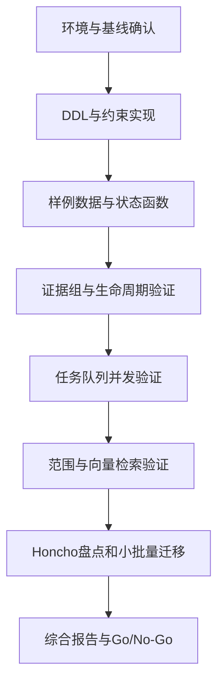

# 统一记忆服务数据模型验证实施方案（Coding Agent 执行版）

> 方案状态：Ready for Implementation  
> 编制日期：2026-09-20  
> 依据文档：《统一记忆服务数据模型详细设计规范 V1.0（冻结版）》  
> 目标阶段：DDL、样例数据、状态流转及 Honcho 迁移可行性验证  
> 推荐环境：Python 3.11+、PostgreSQL 15+、pgvector

---

## 1. 任务目标

本阶段不开发完整统一记忆服务，而是把冻结的数据模型从设计说明推进为可执行、可验证的工程基线，并回答以下问题：

1. 表、约束、索引和复合外键能否在 PostgreSQL 中正确落地；
2. 来源、记忆、证据组、画像、向量、任务和审计能否形成完整闭环；
3. 多来源、AND/OR 证据组、TTL、纠正、推断和画像失效是否可正确执行；
4. 异步任务能否满足幂等、优先级、延迟执行、租约接管和版本防覆盖；
5. 用户、业务域和项目域范围检索是否符合设计；
6. Honcho 历史数据能否以可追溯、可重跑方式映射到新模型；
7. 当前模型是否存在阻塞下一阶段核心服务开发的结构缺陷。

验证通过后，产出正式 DDL、自动化测试、Honcho 小批量迁移工具和验证报告，并将数据模型标记为可进入核心功能工程开发。

---

## 2. 验证边界

### 2.1 本阶段必须实现

- PostgreSQL 和 pgvector 本地验证环境；
- Alembic 数据库 migration；
- 冻结版八张表及全部必要约束、外键和索引；
- 最小数据访问层，不提供完整 HTTP API；
- 来源、记忆、证据和画像的最小状态流转函数；
- PostgreSQL 持久化任务队列的领取、续租、重试和完成逻辑；
- 确定性假向量生成器及向量检索验证；
- 冻结版19项验证用例及补充约束测试；
- Honcho 数据盘点、Dry Run、小批量迁移和迁移报告；
- 最终数据模型验证报告。

### 2.2 本阶段明确不实现

- FastAPI 完整业务接口；
- 管理后台或可视化页面；
- 真实大模型事实抽取质量评估；
- 真实 Embedding 服务调用；
- Agent 授权控制面；
- PostgreSQL RLS；
- 物理冷归档；
- 分布式 MQ 集群；
- 跨用户项目共享；
- 通用实体知识图谱；
- 生产级容量和性能压测；
- Mem0、EverOS 数据迁移。

### 2.3 实施纪律

Coding Agent 必须遵守：

1. 冻结版设计是本阶段唯一模型基线；
2. 不得静默新增核心表或改变字段含义；
3. 发现 PostgreSQL 无法实现、语义互相矛盾或测试无法判定时，记录到 `reports/model_questions.md`，停止相关模块并报告；
4. 不为“以后可能需要”增加新的权限、实体、归档或编排模型；
5. Honcho 源库始终只读，不修改、不补写、不清理；
6. 不提交真实账号、连接串、原始用户数据或未脱敏样例；
7. 每个工作包完成后执行对应自动化测试，不在全部编码结束后一次性补测；
8. 任何与冻结模型不一致的实现必须在最终报告中明确列为偏差。

---

## 3. 技术选型

如果目标代码仓库已有同类依赖，优先复用；否则采用以下基线：

| 类别 | 选型 |
| --- | --- |
| 语言 | Python 3.11+ |
| 数据库 | PostgreSQL 15+ |
| 向量扩展 | pgvector |
| 数据库驱动 | psycopg 3 |
| ORM / SQL | SQLAlchemy 2.x；复杂约束与队列领取使用原生 SQL |
| Migration | Alembic |
| 测试 | pytest |
| 数据校验 | Pydantic 2.x 或 dataclass；按现有项目约定选择 |
| 本地环境 | Docker Compose |
| 代码质量 | Ruff；如仓库已有工具则复用 |

本阶段不引入 Celery、Redis、RabbitMQ。`memory_task` 作为任务状态和调度事实源，通过 PostgreSQL `FOR UPDATE SKIP LOCKED` 验证任务并发语义。

---

## 4. 预期工程目录

如果已有仓库，按现有结构等价放置；如果没有，则建立：

```text
memory-model-validation/
├── docker-compose.yml
├── .env.example
├── pyproject.toml
├── alembic.ini
├── migrations/
│   ├── env.py
│   └── versions/
│       └── 0001_memory_model_v1.py
├── src/
│   └── memory_validation/
│       ├── db.py
│       ├── models.py
│       ├── repositories.py
│       ├── lifecycle.py
│       ├── evidence.py
│       ├── task_queue.py
│       ├── retrieval.py
│       └── deterministic_embedding.py
├── migration_tools/
│   └── honcho/
│       ├── profile.py
│       ├── mapping.py
│       ├── migrate.py
│       ├── validate.py
│       └── README.md
├── tests/
│   ├── conftest.py
│   ├── test_schema_constraints.py
│   ├── test_evidence_groups.py
│   ├── test_lifecycle.py
│   ├── test_task_queue.py
│   ├── test_retrieval.py
│   └── test_honcho_migration.py
├── fixtures/
│   ├── lifecycle_cases.json
│   └── honcho_sanitized_sample.json
├── scripts/
│   ├── reset_validation_db.sh
│   └── run_validation.sh
└── reports/
    ├── data_model_validation_report.md
    ├── validation_results.json
    ├── honcho_profile.json
    ├── honcho_migration_dry_run.json
    └── model_questions.md
```

脚本仅负责调用命令，不在脚本中硬编码密码、用户目录和本机绝对路径。

---

## 5. 总体执行流程



必须按顺序执行。DDL 和约束未通过前，不开始 Honcho 数据迁移。

---

## 6. 工作包一：环境与基线确认

### 6.1 任务

1. 确认冻结版文档和 Honcho DDL 可读取；
2. 检查目标仓库现有 Python、数据库和测试规范；
3. 启动 PostgreSQL 15+ 与 pgvector；
4. 建立独立验证数据库，不复用 Honcho 数据库；
5. 配置两个连接变量：

```text
MEMORY_DATABASE_URL
HONCHO_DATABASE_URL
```

6. `HONCHO_DATABASE_URL` 使用只读账号；
7. 创建 `.env.example`，不提交真实 `.env`；
8. 记录 PostgreSQL、pgvector、Python 和依赖版本。

### 6.2 环境检查

至少验证：

```sql
SELECT version();
SELECT extversion FROM pg_extension WHERE extname = 'vector';
```

### 6.3 输出

- 可启动的数据库环境；
- 依赖清单；
- `reports/data_model_validation_report.md` 初始模板；
- 环境版本记录。

### 6.4 停止条件

- PostgreSQL 低于15且无法升级；
- pgvector 无法安装；
- Honcho 只能使用具有写权限且无法限制的连接；
- 实际 Honcho DDL 与现有 `honcho_schema.sql` 存在无法解释的重大差异。

---

## 7. 工作包二：DDL、约束和索引

### 7.1 表创建顺序

在一个 Alembic revision 中按以下顺序创建：

1. `source_record`；
2. `memory_item`；
3. `profile_property`；
4. `memory_evidence`；
5. `memory_embedding`；
6. `memory_task`；
7. `memory_audit_log`；
8. `migration.external_entity_mapping`。

先执行：

```sql
CREATE EXTENSION IF NOT EXISTS vector;
CREATE SCHEMA IF NOT EXISTS migration;
```

### 7.2 必须落地的约束

#### 来源表

- `tenant_id` 无默认值且非空；
- 唯一键：`tenant_id + source_system + source_type + external_ref_id`；
- `version > 0`；
- `status` 只允许冻结版枚举值；
- `UNIQUE (tenant_id, id)` 供复合外键使用。

#### 记忆表

- `confidence BETWEEN 0 AND 1`；
- `version > 0`；
- `business_domains` 和 `project_domains` 为 NULL 或非空数组；
- `supersedes_id` 使用包含 `tenant_id` 的复合自外键；
- `subject_type`、`cognitive_type`、`status` 使用 CHECK 约束；
- 不在数据库中使用字符串 `common`。

#### 证据表

使用 `num_nonnulls` 和 CHECK 约束保证：

```text
上游 source / memory 恰好一个非空；
下游 memory / profile 恰好一个非空；
supports       = source -> memory；
derives        = memory -> memory；
profile_basis  = memory -> profile；
upstream_version > 0；
upstream_memory_id != downstream_memory_id。
```

所有外键必须包含 `tenant_id`，确保数据库直接拒绝跨租户证据边。

`evidence_group_id` 约束：

- 非空；
- 由应用生成全局唯一 ID；
- 一个 group 只能对应一个下游对象；
- 组的组成不可原地修改；依据变化时失效旧组并新建 group；
- 同一 group、上游、下游和关系类型不得存在重复 active 边。

由于 V1.0 不单独建立 evidence group 主表，“一个 group 只对应一个下游”的约束由写入服务校验，并必须有自动化测试。

#### 画像表

- `property_value` 为 JSONB；
- 画像无项目域；
- 业务域数组写入前去重、排序；
- 使用 PostgreSQL 15 `NULLS NOT DISTINCT` 部分唯一索引，保证同一用户、同一规范化范围、同一属性键只有一个 active 值。

#### 向量表

- 主键：`tenant_id + memory_id + model_id`；
- 复合外键：`tenant_id + memory_id`；
- V1.0 使用 `VECTOR(1536)`；
- HNSW 使用 cosine；
- 优先建立仅覆盖 active 向量的部分索引；如果当前 pgvector 版本不支持预期组合，记录偏差并使用全量 HNSW。

#### 任务表

- 唯一键：`tenant_id + idempotency_key`；
- `attempt_count >= 0`；
- `max_attempts > 0`；
- `priority` 只使用 `0 / 50 / 100`；
- Pending 任务创建时 `worker_id` 和 `locked_until` 必须为空；
- 创建任务时 `available_at` 默认当前时间；
- 对 status、task_type、target_type 建立 CHECK 约束；
- task_type 不包含 `legacy_migrate`。

### 7.3 必须建立的索引

严格按照冻结版建立，并额外核验：

- `memory_task(tenant_id, correlation_id, created_at)`；
- `memory_audit_log(tenant_id, correlation_id, created_at)`；
- `memory_evidence` 三类关系的 group 内唯一部分索引；
- `memory_item` 业务域和项目域 GIN；
- `memory_item` active TTL 部分索引；
- `memory_task` Pending 领取部分索引；
- `external_entity_mapping` 复合主键。

### 7.4 DDL 验证

必须验证：

1. 空库 `alembic upgrade head` 成功；
2. `alembic downgrade base` 成功；
3. 再次 `upgrade head` 成功；
4. 约束和索引名称稳定；
5. `pg_indexes` 中能查询到预期索引；
6. 所有目标表均不存在 `tenant_id DEFAULT 'default'`；
7. migration 不依赖手工执行 SQL。

### 7.5 输出

- `0001_memory_model_v1.py`；
- SQLAlchemy 模型；
- 约束和索引清单；
- `test_schema_constraints.py`。

---

## 8. 工作包三：样例数据与最小领域函数

### 8.1 原则

本阶段不实现完整服务层，只实现能够验证数据模型行为的最小函数：

```text
create_source
update_or_invalidate_source
create_memory
add_evidence_group
recheck_downstream
invalidate_memory
create_or_replace_profile
enqueue_task
claim_tasks
complete_task
fail_and_retry_task
search_memories
```

### 8.2 样例数据

至少准备：

- 两个租户；
- 两个用户；
- 一个 Agent；
- 一个 company 主体；
- email、disk、communication 三个业务域；
- project_a、project_b、project_c 三个项目域；
- 用户事实、推断、Agent经验、公共规则各一组；
- 单来源事实、多来源独立支撑、多个来源共同支撑；
- 事实到推断、记忆到画像；
- active、disputed、invalidated、expired 状态；
- 两个模型 ID 的向量记录；
- 三个优先级的任务。

样例数据全部使用虚构内容，不使用真实 Honcho 用户数据。

### 8.3 确定性假向量

实现本地确定性向量生成器：

- 输入相同文本与 model_id，输出相同1536维向量；
- 不调用外部 Embedding 服务；
- 能构造明显相似和明显不相似的测试向量；
- 输出仅用于数据库结构和排序验证，不评价语义模型质量。

---

## 9. 工作包四：证据组与生命周期验证

### 9.1 证据组判定算法

证据组是不可变的依据集合：

- 同组边为 AND；
- 不同组为 OR；
- 任一组完整，下游可继续有效；
- 所有组均不完整，下游停止使用并进入失效或重算；
- 旧边失效后仍保留，不能在计算完整性时只查询 active 边；
- 上游版本变化后，旧边失效；新依据使用新的 group ID。

组完整性必须遍历该 group 的全部历史组成边，并逐条判断：

```text
edge.status == active
AND upstream.status == active
AND edge.upstream_version == upstream.version
AND upstream 未超过 expired_at
```

所有条件均为真，该组才完整。

下游有效性：

```text
exists(complete evidence_group)
```

对于推断和画像，依赖发生变化时采用保守策略：先停止在线使用，再创建 `dependency_recheck` 或 `profile_rebuild` 任务。

### 9.2 必测场景

#### OR：独立证据组

```text
G1: S1 -> M1
G2: S2 -> M1
```

- S1 失效：G1 不完整，G2 完整，M1 保持 active；
- S2 再失效：所有组不完整，M1 失效。

#### AND：共同证据组

```text
G3: S1 -> M1
G3: S2 -> M1
```

- S1 或 S2 任意一条失效：G3 不完整；
- 无其他完整组时，M1 失效或进入重算。

#### 多事实推断

```text
G4: M1 -> M3
G4: M2 -> M3
```

- M1 失效：G4 不完整；
- 如果存在独立 G5，M3 可保持；
- 不存在其他组时，M3 停止使用并创建重算任务。

#### 画像依据

```text
G6: M3 -> P1, relationship_type=profile_basis
```

- M3 失效：P1 立即停止使用；
- 创建 `profile_rebuild`；
- 重建成功产生画像新版本和新 group。

### 9.3 TTL

验证两层保证：

1. 即使 `ttl_expire` 未执行，查询也通过 `expired_at > now()` 排除；
2. 到期任务执行后状态变为 expired，并创建向量删除和相关重建任务。

### 9.4 冲突与替代

- 新事实明确替代旧事实：新记忆设置 `supersedes_id`，旧记忆 invalidated；
- 无法判断的新旧冲突：相同 `conflict_group_id`，两条记忆 disputed；
- disputed 不进入正常 Agent 上下文；
- 纠正、争议和失效均写审计。

---

## 10. 工作包五：异步任务表验证

### 10.1 `correlation_id`

实现一个根操作：

```text
source写入
→ fact_extract
→ memory写入
→ vector_upsert
→ profile_rebuild
```

验证：

- API/测试入口生成根 correlation_id；
- 所有子任务继承相同值；
- 所有审计记录继承相同值；
- 根据 correlation_id 能查询到任务集合；
- 根据审计 `target_type + target_id` 能定位实际业务对象；
- 业务主表不保存“最近 correlation_id”。

### 10.2 优先级

固定值：

```text
100：纠正、来源删除、依赖检查
 50：在线抽取、正常向量、画像更新
  0：迁移后向量重建、离线回填
```

同时写入三类可执行任务，领取顺序必须为100、50、0；同优先级按 `available_at`、`created_at` 排序。

### 10.3 `available_at`

- 未来时间任务不得被领取；
- 到达时间后可领取；
- 失败重试使用可配置退避：测试环境可使用1秒、2秒、4秒；
- 生产默认值在代码配置中定义，不硬编码到多处。

### 10.4 `locked_until` 与 `worker_id`

任务领取必须原子执行：

```sql
WITH candidates AS (
    SELECT id
    FROM memory_task
    WHERE tenant_id = :tenant_id
      AND (
           (status = 'pending'
            AND available_at <= CURRENT_TIMESTAMP)
        OR (status = 'processing'
            AND locked_until < CURRENT_TIMESTAMP
            AND attempt_count < max_attempts)
      )
    ORDER BY priority DESC, available_at ASC, created_at ASC
    FOR UPDATE SKIP LOCKED
    LIMIT :limit
)
UPDATE memory_task t
SET status = 'processing',
    worker_id = :worker_id,
    locked_until = CURRENT_TIMESTAMP
                   + make_interval(secs => :lease_seconds),
    attempt_count = CASE
        WHEN t.status = 'processing' THEN t.attempt_count + 1
        ELSE t.attempt_count
    END,
    started_at = COALESCE(started_at, CURRENT_TIMESTAMP),
    updated_at = CURRENT_TIMESTAMP
FROM candidates c
WHERE t.id = c.id
RETURNING t.*;
```

并验证：

- 两个数据库连接并发领取，不获得同一任务；
- 未过期租约不能被其他 Worker 接管；
- 租约过期后可由其他 Worker 接管；
- 原 Worker 在失去租约后不能完成任务；
- 长任务可以续租；
- 重试时清空 Worker 和租约；
- 终态可以保留最后 Worker 用于排障。

续租和完成操作必须同时校验 `status='processing'`、`worker_id=:current_worker_id` 且租约未失效，不能只按任务 ID 更新。

### 10.5 版本防覆盖

构造：

```text
任务 input_version=4
执行期间 memory version 更新为5
```

旧任务回写影响行数必须为0，并标记为 `cancelled` 或成功 no-op，不能覆盖版本5。

### 10.6 MQ 边界

本阶段不启动 MQ。最终报告中明确：

- PostgreSQL 是任务状态和调度事实源；
- 未来 MQ 只传递 task ID 或唤醒消费者；
- MQ 不另外维护与数据库冲突的任务状态、重试次数和优先级语义。

---

## 11. 工作包六：范围与向量检索验证

### 11.1 范围查询

验证：

| business_domains | project_domains | 查询上下文 | 是否返回 |
| --- | --- | --- | --- |
| NULL | NULL | 任意业务、项目 | 是 |
| `{email}` | NULL | email / project_a | 是 |
| `{email}` | NULL | disk / project_a | 否 |
| `{email,disk}` | `{project_a}` | disk / project_a | 是 |
| `{email,disk}` | `{project_a}` | disk / project_b | 否 |
| NULL | `{project_a,project_b}` | communication / project_b | 是 |
| NULL | `{project_a}` | 无项目上下文 | 否 |

数组写入前必须去重和排序。空数组写入必须失败。

### 11.2 多主体分路

分别查询并合并：

- 当前用户记忆；
- 当前 Agent 经验；
- 当前公司公共规则。

不得使用仅包含 `subject_type=user` 的单路 SQL 声称返回全部记忆。授权控制不在本阶段实现，但测试显式传入允许的 Agent 和 company 主体集合。

### 11.3 向量验证

- 写入确定性1536维向量；
- 验证 cosine 排序；
- 失效、争议、到期记忆不得返回；
- `content_hash` 与当前记忆不一致的 stale 向量不得返回；
- 相同 memory、不同 model_id 可并存；
- 查询显式指定 model_id；
- 使用 `EXPLAIN (ANALYZE, BUFFERS)` 记录代表性查询计划。

### 11.4 轻量性能冒烟

默认生成3000条虚构记忆及对应向量，执行：

- 单租户、单主体向量查询；
- 业务域、项目域过滤查询；
- 三路主体召回；
- TTL 扫描；
- 来源反向依赖查询。

记录 p50、p95 和查询计划，但本阶段不设生产 SLA。3000条是 MVP 默认冒烟量级：足以覆盖分布和观察查询计划，同时控制1536维向量的生成、写入和重建成本。若该量级下查询计划无法稳定判断 HNSW 或范围索引是否生效，再升至1万条复核；1万条不是本阶段固定验收门槛。若索引完全未被使用或查询出现明显全表扫描，必须分析并记录，不通过“数据量太小”直接忽略。

---

## 12. 工作包七：Honcho 数据迁移验证

### 12.1 迁移工具模式

实现三个独立命令：

```text
profile：只读统计源库结构和数据分布；
dry-run：生成映射计划和风险报告，不写目标库；
migrate：迁移指定小批次，并写目标库、映射、审计和标准任务。
```

迁移工具不是 `memory_task` 的一种 task_type，不创建 `legacy_migrate`。

### 12.2 Profile 输出

输出 `reports/honcho_profile.json`，至少包含：

- workspace、peer、session、message、collection、document 数量；
- observer / observed 类型组合及数量；
- document level 取值及数量；
- document `source_ids` 数量分布；
- `source_ids` 为空、缺失、无法匹配的数量；
- 已软删除 document 数量；
- message 和 document 时间范围；
- 向量维度和同步状态统计；
- source_ids 指向不存在 message 的数量。

如果 observer / observed 组合无法确定新系统 `subject`，停止该组合迁移并输出样例和数量，不自行猜测。

### 12.3 代表性小批次

优先选择：

- 2～3个 workspace；
- 5～10个 session；
- 50～200条 message；
- 20～50条 document；
- 同时包含显式、推断、软删除、多来源和无来源 document。

如果实际数据量不足，选择全部数据并在报告中说明。

### 12.4 映射规则

| Honcho | 目标 |
| --- | --- |
| message | `source_record` |
| document | `memory_item` |
| source_ids | `memory_evidence` supports |
| 显式推导关系 | `memory_evidence` derives |
| collection observer / observed | subject 映射输入 |
| embeddings | 不迁移，重新生成 |
| queue / locks | 不迁移 |

每条外部记录写入：

```text
migration.external_entity_mapping
```

主键使用：

```text
tenant_id
+ source_system
+ source_namespace
+ entity_type
+ external_id
```

### 12.5 证据组迁移

Honcho Document 的一批 `source_ids` 默认使用同一个新 `evidence_group_id`：

- 视为共同依据，不默认每个 message 都能独立支撑；
- `memory_item.metadata.evidence_quality = legacy_batch`；
- 批内任一来源失效时触发 dependency_recheck；
- 缺失来源的 Document 创建 `source_type=legacy_import` 合成来源；
- 合成来源 metadata 保留 Honcho document ID、workspace 和迁移批次；
- 不伪造不存在的 message 关系。

### 12.6 事务和幂等

- 目标实体与映射表在同一事务写入；
- 重复运行首先查询映射；
- 第二次运行不得新增重复 source、memory 和 evidence；
- mapping 存在但目标实体不存在时，视为严重一致性错误并停止；
- 目标存在但 mapping 不存在时，不自动认定为同一实体，输出冲突；
- 迁移后任务使用正常类型，如 `vector_upsert`；
- 批量任务 `priority=0`；
- 任务和审计继承迁移批次 correlation_id。

### 12.7 迁移报告

输出 `reports/honcho_migration_dry_run.json` 和最终 Markdown 报告，至少包含：

```text
源 message 数
已迁移 source_record 数
源 document 数
已迁移 memory_item 数
已建立 evidence 数和 group 数
缺失 source_ids 数
无法识别 subject 数
软删除数据数
合成 legacy_import 来源数
跳过数
失败数及原因
待生成向量数
第二次迁移新增记录数
```

第二次执行新增记录数必须为0。

---

## 13. 自动化测试矩阵

### 13.1 冻结版19项核心用例

| ID | 用例 | 关键断言 |
| --- | --- | --- |
| T01 | 单来源生成事实 | 记忆、group、证据、向量任务、审计完整 |
| T02 | 第二来源独立表达同一事实 | 不新增记忆，新增独立 evidence group |
| T03 | 删除一个独立组来源 | 另一个 group 完整，记忆保持 active |
| T04 | 所有 group 不完整 | 记忆停止检索并触发下游任务 |
| T05 | 多事实共同支撑推断 | 同组 derives 可追溯 |
| T06 | 推断依据失效 | 推断停止使用并重算 |
| T07 | 画像依据失效 | 画像停止使用并重建 |
| T08 | 多业务、多项目范围 | 仅允许范围返回 |
| T09 | TTL 已到但任务未运行 | 查询立即排除 |
| T10 | 旧版本任务回写 | 影响0行，不覆盖新版本 |
| T11 | 跨租户证据边 | 数据库拒绝 |
| T12 | 重复任务 | 幂等键拒绝重复 |
| T13 | Honcho 小批量重复迁移 | 第二次新增0条 |
| T14 | Honcho 缺失来源 | 建立 legacy_import 并报告 |
| T15 | AND组失去一条证据 | 该组不成立 |
| T16 | OR组失去一组 | 其他组成立，记忆有效 |
| T17 | 任务租约到期 | 新 Worker 接管，旧 Worker 不能回写 |
| T18 | 三档优先级 | 领取顺序100、50、0 |
| T19 | 多级任务链路 | task/audit 继承同一 correlation_id |

### 13.2 补充数据库约束测试

- tenant_id 为空失败；
- source 幂等键重复失败；
- confidence 越界失败；
- 空业务域或项目域数组失败；
- 非法 relationship_type 与字段组合失败；
- evidence group 内重复 active 边失败；
- evidence self-loop 失败；
- profile active 唯一性失败；
- embedding 同 memory/model 重复失败；
- task 非法 priority 失败；
- attempt_count 小于0失败；
- external mapping 重复失败；
- supersedes 跨租户失败。

### 13.3 测试执行要求

- 每个测试独立事务或独立数据库清理；
- 不依赖执行顺序；
- 不通过 sleep 长时间等待；测试时间使用可控制时钟或短退避；
- 并发领取测试必须使用两个独立数据库连接；
- 失败输出包含 tenant、对象 ID、group ID 和 correlation_id；
- CI 或本地一条命令可以执行全部测试。

---

## 14. 执行命令约定

根据项目包管理工具调整，但至少提供等价命令：

```bash
docker compose up -d postgres
alembic upgrade head
pytest -q
python -m migration_tools.honcho.profile
python -m migration_tools.honcho.migrate --dry-run
python -m migration_tools.honcho.migrate --limit-documents 50
python -m migration_tools.honcho.validate
```

提供统一入口：

```bash
./scripts/run_validation.sh
```

统一入口必须：

1. 检查环境；
2. 执行 migration；
3. 执行测试；
4. 生成验证结果 JSON；
5. 不自动连接或迁移 Honcho，Honcho 步骤需显式参数启用。

---

## 15. 阶段验收门槛

### 15.1 结构可行性

- 空库 migration 可正向、回滚、再次正向执行；
- 核心外键、CHECK、唯一索引和 HNSW/GIN 索引存在；
- 数据库能拒绝跨租户、非法关系和重复数据；
- 没有依赖应用约定才能避免的关键悬空外键。

### 15.2 行为可行性

- 19项核心用例全部通过；
- AND/OR evidence group 判定符合冻结语义；
- TTL、失效和 disputed 数据不进入在线结果；
- 任务满足幂等、优先级、延迟、租约和版本校验；
- correlation_id 能归组任务和审计并定位目标对象。

### 15.3 迁移可行性

- Honcho Profile 报告生成；
- observer / observed 映射规则有明确结论；
- 代表性样本完成 Dry Run 和实际迁移；
- 第二次运行新增记录数为0；
- 不存在悬空 evidence；
- 缺失来源和无法识别主体均有明确报告；
- 源库无写入。

### 15.4 Go / No-Go

满足全部门槛时，最终报告结论为：

```text
GO：数据模型 V1.0 可进入统一记忆服务核心功能开发。
```

出现以下任一情况为 No-Go：

- 无法通过数据库约束阻止跨租户证据关系；
- evidence group 无法稳定表达 AND/OR 充分性；
- 来源失效后仍可通过正常检索读到相关记忆；
- 旧任务可覆盖新版本；
- Honcho 主体或来源关系存在大规模无法解释的映射；
- 重复迁移产生重复数据；
- 冻结版核心字段需要结构性重构而非小型 migration 修正。

No-Go 时不要继续开发完整服务，应先输出问题、影响范围和最小修订建议。

---

## 16. 最终交付物

Coding Agent 必须提交：

1. PostgreSQL + pgvector 本地环境配置；
2. Alembic V1.0 migration；
3. SQLAlchemy 模型和最小数据访问层；
4. 生命周期与 evidence group 判定实现；
5. PostgreSQL 任务队列最小实现；
6. 确定性向量与范围检索实现；
7. 自动化测试及测试结果；
8. Honcho Profile、Dry Run、小批量迁移与校验工具；
9. 脱敏样例数据；
10. `reports/data_model_validation_report.md`；
11. `reports/validation_results.json`；
12. 所有设计偏差和未决问题清单。

最终报告必须包含：

```text
环境和版本
实际表、约束和索引
各测试用例结果
查询计划和轻量性能结果
Honcho 数据分布
Honcho 迁移对账
发现的问题与修订
剩余风险
Go / No-Go 结论
下一阶段建议
```

---

## 17. 推荐工作包顺序与预估

| 工作包 | 内容 | 预估 |
| --- | --- | ---: |
| WP1 | 环境、Alembic、表结构 | 1～1.5人日 |
| WP2 | 约束、索引、样例数据 | 1人日 |
| WP3 | evidence group 与生命周期 | 1.5～2人日 |
| WP4 | 任务队列与并发测试 | 1～1.5人日 |
| WP5 | 范围、向量和性能冒烟 | 1人日 |
| WP6 | Honcho Profile 与小批量迁移 | 1.5～2人日 |
| WP7 | 综合报告与修订 | 0.5～1人日 |

总工作量约7～10人日。Coding Agent 可加速编码，但不能省略数据库约束、并发测试和迁移对账。

---

## 18. Coding Agent 完成判定

只有同时满足以下条件，任务才算完成：

- 代码和 migration 已实际执行，不只是生成文件；
- PostgreSQL 中真实存在表、约束和索引；
- 自动化测试全部运行并输出结果；
- evidence group、任务租约和版本防覆盖经过真实数据库验证；
- Honcho 至少完成 Profile 和 Dry Run；在源库可访问时完成代表性小批量迁移；
- 最终报告明确说明已验证、未验证和失败内容；
- 没有通过捕获异常后直接忽略来伪造测试通过；
- 没有为了让测试通过而削弱冻结版约束；
- 给出明确的 Go / No-Go 结论。

如果 Honcho 源库暂时不可访问，允许将小批量实际迁移标记为阻塞，但 DDL、生命周期、任务队列、范围检索和基于脱敏 fixture 的迁移幂等测试仍必须全部完成。
